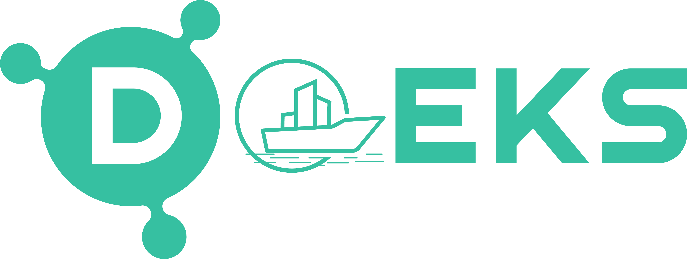

# [Data on Amazon EKS (DoEKS)](https://awslabs.github.io/data-on-eks/)
(pronounce Do.eks)

### Build, Scale, and Optimize Data & AI/ML Platforms on [Amazon EKS](https://aws.amazon.com/eks/) 🚀

Welcome to the **Data on EKS** repository, a comprehensive resource for scaling your data and machine learning workloads on Amazon EKS and unlocking the power of [Gen AI](https://aws.amazon.com/generative-ai/). Harness the capabilities of [AWS Trainium](https://aws.amazon.com/machine-learning/trainium/), [AWS Inferentia](https://aws.amazon.com/machine-learning/inferentia/) and [NVIDIA GPUs](https://aws.amazon.com/nvidia/) to scale and optimize your Gen AI workloads with ease.

This open-source tool offers a comprehensive collection of Terraform Blueprints, featuring industry best practices, to effortlessly deploy end-to-end solutions on Amazon EKS with advanced logging and observability. Dive into a diverse range of practical examples, showcasing the potential and flexibility of running AI/ML workloads on EKS, including [Apache Spark](https://spark.apache.org/), [PyTorch](https://pytorch.org/), [Tensorflow](https://www.tensorflow.org/), [XGBoost](https://xgboost.readthedocs.io/en/stable/), and more. Unlock valuable insights from benchmark reports and access expert guidance to optimize your data solutions. Discover how to effortlessly create robust clusters for [Amazon EMR on EKS](https://docs.aws.amazon.com/emr/latest/EMR-on-EKS-DevelopmentGuide/emr-eks.html), [Apache Spark](https://spark.apache.org/), [Apache Flink](https://flink.apache.org/), [Apache Kafka](https://kafka.apache.org/), and [Apache Airflow](https://airflow.apache.org/), while exploring cutting-edge machine learning platforms like [Ray](https://www.ray.io/), [Kubeflow](https://awslabs.github.io/kubeflow-manifests/), [Jupyterhub](https://jupyter.org/hub), [NVIDIA GPUs](https://aws.amazon.com/nvidia/), [AWS Trainium](https://aws.amazon.com/machine-learning/trainium/), and [AWS Inferentia](https://aws.amazon.com/machine-learning/inferentia/) on EKS.

> **Note**: DoEKS is actively being developed for various patterns. To see what features are in progress, please check out the [issues](https://github.com/awslabs/data-on-eks/issues) section of our repository.

## 🏗️ Architecture
The diagram below showcases the wide array of open-source data tools, Kubernetes operators, and frameworks supported by DoEKS. It also highlights the seamless integration of AWS Data Analytics managed services with the powerful capabilities of DoEKS open-source tools.

## 🌟 Features
Data on EKS(DoEKS) solution is categorized into the following focus areas.

🎯  [Data Analytics](https://awslabs.github.io/data-on-eks/docs/blueprints/data-analytics) on EKS

🎯  [AI/ML](https://awslabs.github.io/data-on-eks/docs/blueprints/ai-ml) on EKS

🎯  [Streaming Platforms](https://awslabs.github.io/data-on-eks/docs/blueprints/streaming-platforms) on EKS

🎯  [Scheduler Workflow Platforms](https://awslabs.github.io/data-on-eks/docs/blueprints/job-schedulers) on EKS

🎯  [Distributed Databases & Query Engine](https://awslabs.github.io/data-on-eks/docs/blueprints/distributed-databases) on EKS

## 🏃‍♀️Getting Started
In this repository, you'll find a variety of deployment blueprints for creating Data/ML platforms with Amazon EKS clusters. These examples are just a small selection of the available blueprints - visit the [DoEKS website](https://awslabs.github.io/data-on-eks/) for the complete list of options.

🚀 [JupyterHub on EKS](https://awslabs.github.io/data-on-eks/docs/blueprints/ai-ml/jupyterhub) 👈 This blueprint deploys a self-managed JupyterHub on EKS with Amazon Cognito authentication.

🚀 [Ray on EKS](https://awslabs.github.io/data-on-eks/docs/blueprints/ai-ml/ray) 👈 This blueprint deploys Ray Operator on EKS with sample scripts.

🚀 [Trainium/Inferentia with TorchX and Volcano on EKS](https://awslabs.github.io/data-on-eks/docs/blueprints/ai-ml/trainium) 👈 This blueprint deploys Gen AI blueprint on EKS with sample Training scripts.

🚀 [EMR-on-EKS with Karpenter](https://awslabs.github.io/data-on-eks/docs/blueprints/amazon-emr-on-eks/emr-eks-karpenter)  👈 Start here if you are new to EMR on EKS. This blueprint deploys EMR on EKS cluster and uses [Karpenter](https://karpenter.sh/) to scale Spark jobs.

🚀 [Spark Operator with Apache YuniKorn on EKS](https://awslabs.github.io/data-on-eks/docs/blueprints/data-analytics/spark-operator-yunikorn) 👈 This blueprint deploys EKS cluster and uses Spark Operator and Apache YuniKorn for running self-managed Spark jobs

🚀 [Self-managed Airflow on EKS](https://awslabs.github.io/data-on-eks/docs/blueprints/job-schedulers/self-managed-airflow) 👈 This blueprint sets up a self-managed Apache Airflow on an Amazon EKS cluster, following best practices.

🚀 [Argo Workflows on EKS](https://awslabs.github.io/data-on-eks/docs/blueprints/job-schedulers/argo-workflows-eks) 👈 This blueprint sets up a self-managed Argo Workflow on an Amazon EKS cluster, following best practices.

🚀 [Kafka on EKS](https://awslabs.github.io/data-on-eks/docs/blueprints/streaming-platforms/kafka) 👈 This blueprint deploys a self-managed Kafka on EKS using the popular Strimzi Kafka operator.

## 🗂️ Documentation
For instructions on how to deploy Data on EKS patterns and run sample tests, visit the [DoEKS website](https://awslabs.github.io/data-on-eks/).

## 🏆 Motivation
[Kubernetes](https://kubernetes.io/) is a widely adopted system for orchestrating containerized software at scale. As more users migrate their data and machine learning workloads to Kubernetes, they often face the complexity of managing the Kubernetes ecosystem and selecting the right tools and configurations for their specific needs.

At [AWS](https://aws.amazon.com/), we understand the challenges users encounter when deploying and scaling data workloads on Kubernetes. To simplify the process and enable users to quickly conduct proof-of-concepts and build production-ready clusters, we have developed Data on EKS (DoEKS). DoEKS offers opinionated open-source blueprints that provide end-to-end logging and observability, making it easier for users to deploy and manage Spark on EKS, Kubeflow, MLFlow, Airflow, Presto, Kafka, Cassandra, and other data workloads. With DoEKS, users can confidently leverage the power of Kubernetes for their data and machine learning needs without getting overwhelmed by its complexity.

## 🤝 Support & Feedback
DoEKS is maintained by AWS Solution Architects and is not an AWS service. Support is provided on a best effort basis by the Data on EKS Blueprints community. If you have feedback, feature ideas, or wish to report bugs, please use the [Issues](https://github.com/awslabs/data-on-eks/issues) section of this GitHub.

## 🔐 Security
See [CONTRIBUTING](CONTRIBUTING.md#security-issue-notifications) for more information.

## 💼 License
This library is licensed under the Apache 2.0 License.

## 🙌 Community
We welcome all individuals who are enthusiastic about data on Kubernetes to become a part of this open source community. Your contributions and participation are invaluable to the success of this project.

Built with ❤️ at AWS.
