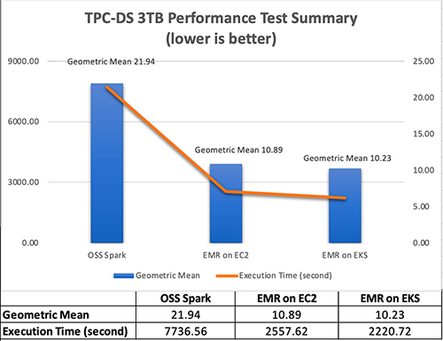
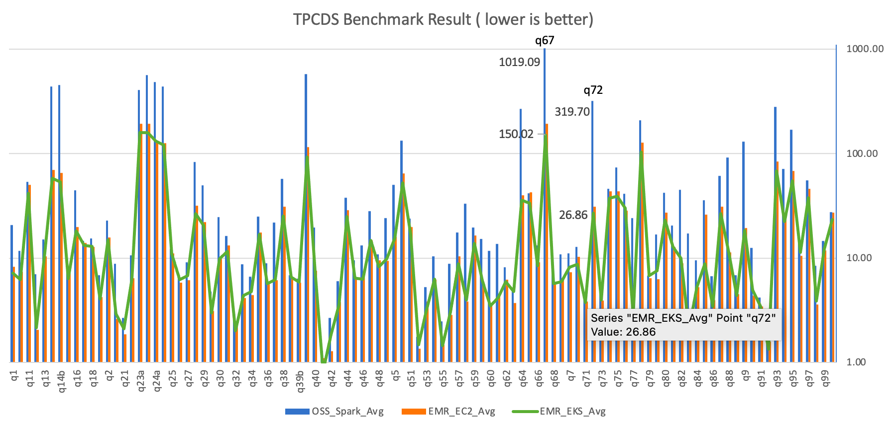

# Amazon EMR on Amazon EKS provides up to 61% lower costs and up to 68% performance improvement for Spark workloads

Amazon EMR on Amazon EKS is a deployment option offered by Amazon EMR that enables you to run Apache Spark applications on Amazon Elastic Kubernetes Service (Amazon EKS) in a cost-effective manner. It uses the EMR runtime for Apache Spark to increase performance so that your jobs run faster and cost less.

In our benchmark tests using TPC-DS datasets at 3 TB scale, we observed that Amazon EMR on EKS provides up to 61% lower costs and up to 68% improved performance compared to running open-source Apache Spark on Amazon EKS via equivalent configurations. In this post, we walk through the performance test process, share the results, and discuss how to reproduce the benchmark. We also share a few techniques to optimize job performance that could lead to further cost-optimization for your Spark workloads.

## How does Amazon EMR on EKS reduce cost and improve performance?

The EMR runtime for Spark is a performance-optimized runtime for Apache Spark that is 100% API compatible with open-source Apache Spark. It’s enabled by default with Amazon EMR on EKS. It helps run Spark workloads faster, leading to lower running costs. It includes multiple performance optimization features, such as Adaptive Query Execution (AQE), dynamic partition pruning, flattening scalar subqueries, bloom filter join, and more.

In addition to the cost benefit brought by the EMR runtime for Spark, Amazon EMR on EKS can take advantage of other AWS features to further optimize cost. For example, you can run Amazon EMR on EKS jobs on Amazon Elastic Compute Cloud (Amazon EC2) Spot Instances, providing up to 90% cost savings when compared to On-Demand Instances. Also, Amazon EMR on EKS supports Arm-based Graviton EC2 instances, which creates a 15% performance improvement and up to 30% cost savings when compared a Graviton2-based M6g to M5 instance type.

The recent graceful executor decommissioning feature makes Amazon EMR on EKS workloads more robust by enabling Spark to anticipate Spot Instance interruptions. Without the need to recompute or rerun impacted Spark jobs, Amazon EMR on EKS can further reduce job costs via critical stability and performance improvements.

Additionally, through container technology, Amazon EMR on EKS offers more options to debug and monitor Spark jobs. For example, you can choose Spark History Server, Amazon CloudWatch, or Amazon Managed Prometheus and Amazon Managed Grafana (for more details, refer to the Monitoring and Logging workshop). Optionally, you can use familiar command line tools such as kubectl to interact with a job processing environment and observe Spark jobs in real time, which provides a fail-fast and productive development experience.

Amazon EMR on EKS supports multi-tenant needs and offers application-level security control via a job execution role. It enables seamless integrations to other AWS native services without a key-pair set up in Amazon EKS. The simplified security design can reduce your engineering overhead and lower the risk of data breach. Furthermore, Amazon EMR on EKS handles security and performance patches so you can focus on building your applications.

## Benchmarking
This post provides an end-to-end Spark benchmark solution so you can get hands-on with the performance test process. The solution uses unmodified TPC-DS data schema and table relationships, but derives queries from TPC-DS to support the Spark SQL test case. It is not comparable to other published TPC-DS benchmark results.

Key concepts
Transaction Processing Performance Council-Decision Support (TPC-DS) is a decision support benchmark that is used to evaluate the analytical performance of big data technologies. Our test data is a TPC-DS compliant dataset based on the TPC-DS Standard Specification, Revision 2.4 document, which outlines the business model and data schema, relationship, and more. As the whitepaper illustrates, the test data contains 7 fact tables and 17 dimension tables, with an average of 18 columns. The schema consists of essential retailer business information, such as customer, order, and item data for the classic sales channels: store, catalog, and internet. This source data is designed to represent real-world business scenarios with common data skews, such as seasonal sales and frequent names. Additionally, the TPC-DS benchmark offers a set of discrete scaling points (scale factors) based on the approximate size of the raw data. In our test, we chose the 3 TB scale factor, which produces 17.7 billion records, approximately 924 GB compressed data in Parquet file format.

Test approach
A single test session consists of 104 Spark SQL queries that were run sequentially. To get a fair comparison, each session of different deployment types, such as Amazon EMR on EKS, was run three times. The average runtime per query from these three iterations is what we analyze and discuss in this post. Most importantly, it derives two summarized metrics to represent our Spark performance:

Total execution time – The sum of the average runtime from three iterations
Geomean – The geometric mean of the average runtime
Test results
In the test result summary (see the following figure), we discovered that the Amazon EMR-optimized Spark runtime used by Amazon EMR on EKS is approximately 2.1 times better than the open-source Spark on Amazon EKS in geometric mean and 3.5 times faster by the total runtime.

The following figure breaks down the performance summary by queries. We observed that EMR runtime for Spark was faster in every query compared to open-source Spark. Query q67 was the longest query in the performance test. The average runtime with open-source Spark was 1019.09 seconds. However, it took 150.02 seconds with Amazon EMR on EKS, which is 6.8 times faster. The highest performance gain in these long-running queries was q72—319.70 seconds (open-source Spark) vs. 26.86 seconds (Amazon EMR on EKS), a 11.9 times improvement.

For full [blog link](https://aws.amazon.com/blogs/big-data/amazon-emr-on-amazon-eks-provides-up-to-61-lower-costs-and-up-to-68-performance-improvement-for-spark-workloads/)