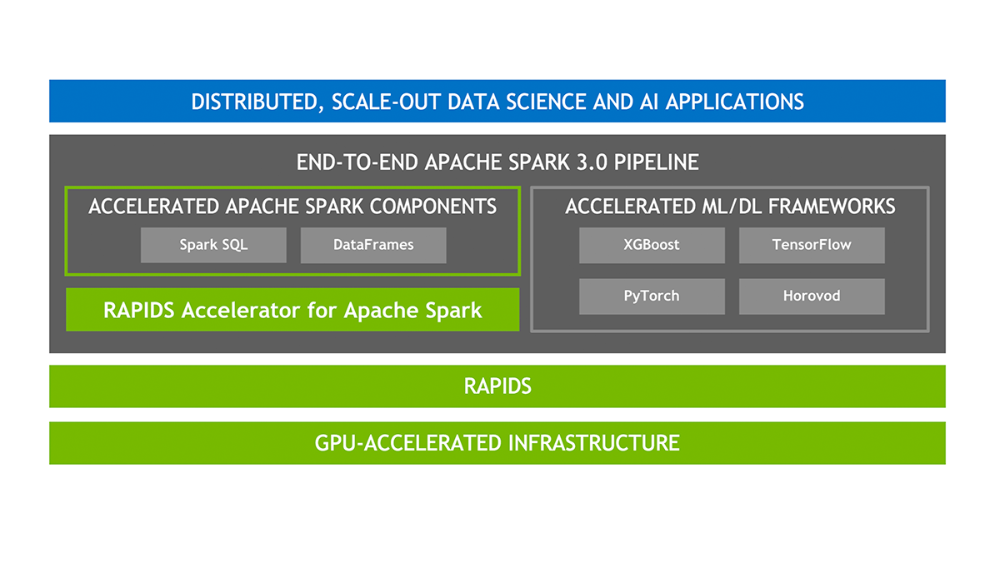
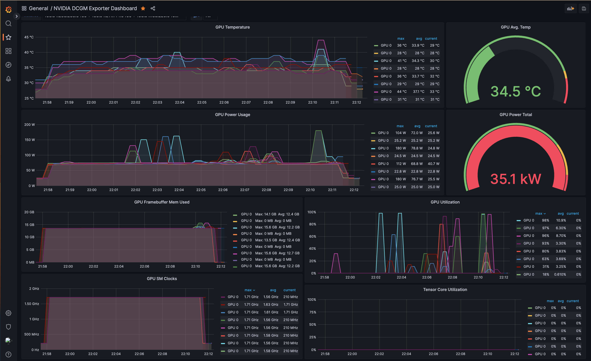

import CollapsibleContent from '../../../src/components/CollapsibleContent';

# EMR on EKS NVIDIA RAPIDS Accelerator for Apache Spark

### What is NVIDIA RAPIDS Accelerator for Apache Spark?
NVIDIA CUDA® is a revolutionary parallel computing platform that supports accelerating computational operations on NVIDIA GPU architecture. RAPIDS, incubated at NVIDIA, is a suite of open-source libraries layered on top of CUDA that enables GPU acceleration of data science pipelines. NVIDIA has created a RAPIDS Accelerator for Spark 3 that intercepts and accelerates extract, transform and load pipelines by dramatically improving the performance of Spark SQL and DataFrame operations

The RAPIDS Accelerator for Apache Spark combines the power of the RAPIDS cuDF library and the scale of the Spark distributed computing framework. The RAPIDS Accelerator library also has a built-in accelerated shuffle based on UCX that can be configured to leverage GPU-to-GPU communication and RDMA capabilities.



### EMR support for NVIDIA RAPIDS Accelerator for Apache Spark
Amazon EMR on EKS now supports accelerated computing over graphics processing unit (GPU) instance types using Nvidia RAPIDS Accelerator for Apache Spark. The growing adoption of artificial intelligence (AI) and machine learning (ML) in analytics has increased the need for processing data quickly and cost efficiently with GPUs. Nvidia RAPIDS Accelerator for Apache Spark helps users to leverage the benefit of GPU performance while saving infrastructure costs.

### Features
- Accelerate the performance of data preparation tasks to quickly move to the next stage of the pipeline. This allows models to be trained faster, while freeing up data scientists and engineers to focus on the most critical activities.
- Spark 3 orchestrates end-to-end pipelines—from data ingest, to model training, to visualization. The same GPU-accelerated infrastructure can be used for both Spark and machine learning or deep learning frameworks, eliminating the need for separate clusters and giving the entire pipeline access to GPU acceleration.
- Spark 3 provides columnar processing support in the Catalyst query optimizer, which is what the RAPIDS Accelerator plugs into to accelerate SQL and DataFrame operators. When the query plan is executed, those operators can then be run on GPUs within the Spark cluster.
- NVIDIA has also created a new Spark shuffle implementation that optimizes the data transfer between Spark processes. This shuffle implementation is built on GPU-accelerated communication libraries, including UCX, RDMA, and NCCL.

### Test Dataset for training
[Fannie Mae’s Single-Family Loan Performance Data](http://www.fanniemae.com/portal/funding-the-market/data/loan-performance-data.html) released an extensive dataset beginning in
2013 that provides insight into the credit performance of a portion of Fannie Mae’s single-family book of
business. The dataset provides monthly loan-level detail and is offered to help investors gain a better understanding of the credit performance of a portion of single-family loans owned or guaranteed by Fannie Mae.

<CollapsibleContent header={<h2><span>Deploying the Solution</span></h2>}>

In this [example](https://github.com/awslabs/data-on-eks/tree/main/ai-ml/emr-spark-rapids), you will provision the following resources required to run XGBoost Spark RAPIDS Accelerator job with [Fannie Mae’s Single-Family Loan Performance Data](https://capitalmarkets.fanniemae.com/credit-risk-transfer/single-family-credit-risk-transfer/fannie-mae-single-family-loan-performance-data).

This example deploys the following resources

- Creates a new sample VPC, 2 Private Subnets and 2 Public Subnets
- Creates Internet gateway for Public Subnets and NAT Gateway for Private Subnets
- Creates EKS Cluster Control plane with public endpoint (for demo reasons only) with core managed node group, Spark driver node group and GPU Spot node group for ML workloads.
- Ubuntu EKS AMI used for Spark Driver and Spark executor GPU Node groups
- NVIDIA GPU Operator helm add-on deployed
- Deploys Metrics server, Cluster Autoscaler, Karpenter, Grafana, AMP and Prometheus server.
- Enables EMR on EKS  
  - Creates two namespaces (`emr-ml-team-a`, `emr-ml-team-b`) for data teams
  - Creates Kubernetes role and role binding(`emr-containers` user) for both namespaces
  - IAM roles for both teams needed for job execution
  - Update `AWS_AUTH` config map with `emr-containers` user and `AWSServiceRoleForAmazonEMRContainers` role
  - Create a trust relationship between the job execution role and the identity of the EMR managed service account
  - Create EMR Virtual Cluster for `emr-ml-team-a` & `emr-ml-team-b` and IAM policies for both

### Prerequisites

Ensure that you have installed the following tools on your machine.

1. [aws cli](https://docs.aws.amazon.com/cli/latest/userguide/install-cliv2.html)
2. [kubectl](https://Kubernetes.io/docs/tasks/tools/)
3. [terraform](https://learn.hashicorp.com/tutorials/terraform/install-cli)

### Deploy

Clone the repository

```bash
git clone https://github.com/awslabs/data-on-eks.git
```

:::danger
Please be aware of the costs for using GPU Instances before deploying this blueprint.
This blueprint creates 8 **g5.2xlarge** GPU instances to train the dataset using NVIDIA Spark-RAPIDS accelerator
:::

Navigate into one of the example directories and run `install.sh` script

```bash
cd data-on-eks/ai-ml/emr-spark-rapids/ && chmod +x install.sh
./install.sh
```

### Verify the resources

Verify the Amazon EKS Cluster and Amazon Managed service for Prometheus

```bash
aws eks describe-cluster --name emr-spark-rapids
```

```bash
# Creates k8s config file to authenticate with EKS
aws eks --region us-west-2 update-kubeconfig --name emr-spark-rapids Cluster

kubectl get nodes # Output shows the EKS Managed Node group nodes

# Verify EMR on EKS Namespaces `emr-ml-team-a` and `emr-ml-team-b`
kubectl get ns | grep emr-ml-team
```

```bash
kubectl get pods --namespace=gpu-operator

# Output example for GPU node group with one node running

    NAME                                                              READY   STATUS
    gpu-feature-discovery-7gccd                                       1/1     Running
    gpu-operator-784b7c5578-pfxgx                                     1/1     Running
    nvidia-container-toolkit-daemonset-xds6r                          1/1     Running
    nvidia-cuda-validator-j2b42                                       0/1     Completed
    nvidia-dcgm-exporter-vlttv                                        1/1     Running
    nvidia-device-plugin-daemonset-r5m7z                              1/1     Running
    nvidia-device-plugin-validator-hg78p                              0/1     Completed
    nvidia-driver-daemonset-6s9qv                                     1/1     Running
    nvidia-gpu-operator-node-feature-discovery-master-6f78fb7cbx79z   1/1     Running  
    nvidia-gpu-operator-node-feature-discovery-worker-b2f6b           1/1     Running
    nvidia-gpu-operator-node-feature-discovery-worker-dc2pq           1/1     Running
    nvidia-gpu-operator-node-feature-discovery-worker-h7tpq           1/1     Running
    nvidia-gpu-operator-node-feature-discovery-worker-hkj6x           1/1     Running
    nvidia-gpu-operator-node-feature-discovery-worker-zjznr           1/1     Running  
    nvidia-operator-validator-j7lzh                                   1/1     Running
```

</CollapsibleContent>


<CollapsibleContent header={<h2><span>Execute XGboost Spark Job</span></h2>}>

### Step1: Create a docker image

- Change directory to the below folder

```bash
cd ai-ml/emr-spark-rapids/examples/xgboost
```

- Ignore this step if you already have an ECR repository
```bash
aws create-repository --registry-id $ACCOUNT_NUMBER --repository-name $REPOSITORY_NAME --region us-west-2
```

- Login to the EMR on EKS ECR repository to pull the US-east-1 Spark Rapids base image

Login to the ECR in `us-west-2` to download the Spark Rapids EMR on EKS image. If you are in a different region, refer to: https://docs.aws.amazon.com/emr/latest/EMR-on-EKS-DevelopmentGuide/docker-custom-images-tag.html

```bash
aws ecr get-login-password --region us-west-2 | docker login --username AWS --password-stdin <BASE_IMAGE_ACCOUNT>.dkr.ecr.us-west-2.amazonaws.com
```

- Build your Docker image locally
```bash
docker build -t <ACCOUNT_NUMBER.dkr.ecr.us-west-2.amazonaws.com/<REPOSITORY_NAME>:<TAG> -f Dockerfile .
```

- Login to your ECR repository
```bash
aws ecr get-login-password --region us-west-2 | docker login --username AWS --password-stdin <ACCOUNT_NUMBER>.dkr.ecr.us-west-2.amazonaws.com
```

- Push Docker image to your ECR
```bash
docker push <ACCOUNT_NUMBER>.dkr.ecr.us-west-2.amazonaws.com/<REPOSITORY_NAME>:<TAG>
```

- Verify ECR repository
```bash
aws ecr describe-repositories --repository-names <REPOSITORY_NAME> --region us-west-2
```

### Step2: Download Input data(Fannie Mae’s Single-Family Loan Performance Data)

Dataset is derived from [Fannie Mae’s Single-Family Loan Performance Data](http://www.fanniemae.com/portal/funding-the-market/data/loan-performance-data.html) with all rights reserved by Fannie Mae.

1. Go to the [Fannie Mae](https://capitalmarkets.fanniemae.com/credit-risk-transfer/single-family-credit-risk-transfer/fannie-mae-single-family-loan-performance-data) website
2. Click on [Single-Family Loan Performance Data](https://datadynamics.fanniemae.com/data-dynamics/?&_ga=2.181456292.2043790680.1657122341-289272350.1655822609#/reportMenu;category=HP)
    - Register as a new user if you are using the website for the first time
    - Use the credentials to login
3. Select [HP](https://datadynamics.fanniemae.com/data-dynamics/#/reportMenu;category=HP)
4. Click on  **Download Data** and choose *Single-Family Loan Performance Data*
5. You will find a tabular list of `Acquisition and Performance` files sorted based on year and quarter. Click on the file to download `Eg: 2017Q1.zip`
6. Unzip the downlad file to extract the csv file `Eg: 2017Q1.csv`
7. Copy only the csv files to S3 bucket under ${S3_BUCKET}/${EMR_VIRTUAL_CLUSTER_ID}/spark-rapids-emr/input/fannie-mae-single-family-loan-performance/. See the example below which uses 3 years(One file for each quarter and total of 12 files) worth of data.

```
 aws s3 ls s3://emr-spark-rapids-<aws-account-id>-us-west-2/949wt7zuphox1beiv0i30v65i/spark-rapids-emr/input/fannie-mae-single-family-loan-performance/
    2023-06-24 21:38:25 2301641519 2000Q1.csv
    2023-06-24 21:38:25 9739847213 2020Q2.csv
    2023-06-24 21:38:25 10985541111 2020Q3.csv
    2023-06-24 21:38:25 11372073671 2020Q4.csv
    2023-06-23 16:38:36 9603950656 2021Q1.csv
    2023-06-23 16:38:36 7955614945 2021Q2.csv
    2023-06-23 16:38:36 5365827884 2021Q3.csv
    2023-06-23 16:38:36 4390166275 2021Q4.csv
    2023-06-22 19:20:08 2723499898 2022Q1.csv
    2023-06-22 19:20:08 1426204690 2022Q2.csv
    2023-06-22 19:20:08  595639825 2022Q3.csv
    2023-06-22 19:20:08  180159771 2022Q4.csv
```

### Step3: Execute the EMR Spark Job

In this step, we will use helper shell script to run the job. This script asks for input

```bash
cd ai-ml/emr-spark-rapids/examples/xgboost/ && chmod +x execute_spark_rapids_xgboost.sh
./execute_spark_rapids_xgboost.sh

# This script asks for the following input which you can get from Terraform outputs. See the example below

    Did you copy the fannie-mae-single-family-loan-performance data to S3 bucket(y/n): y
    Enter the customized Docker image URI: public.ecr.aws/o7d8v7g9/emr-6.10.0-spark-rapids:0.11
    Enter EMR Virtual Cluster AWS Region: us-west-2
    Enter the EMR Virtual Cluster ID: 949wt7zuphox1beiv0i30v65i
    Enter the EMR Execution Role ARN: arn:aws:iam::464566837657:role/emr-spark-rapids-emr-eks-data-team-a
    Enter the CloudWatch Log Group name: /emr-on-eks-logs/emr-spark-rapids/emr-ml-team-a
    Enter the S3 Bucket for storing PySpark Scripts, Pod Templates, Input data and Output data.<bucket-name>: emr-spark-rapids-464566837657-us-west-2
```

:::info
First time this execution make take longer to download the image for EMR Job Pod, Driver and Executor pods. Each Pod may take upto 8 mins to download the docker image. Once the image is cached then the subsequent runs will be faster under 30 secs.
:::

### Step4: Verify the Job results

- Login to verify the Spark driver pod logs from Cloudwatch logs or S3 bucket

e.g., CW Log fie path

```
/emr-on-eks-logs/emr-spark-rapids/emr-ml-team-a
spark-rapids-emr/949wt7zuphox1beiv0i30v65i/jobs/0000000327fe50tosa4/containers/spark-0000000327fe50tosa4/spark-0000000327fe50tosa4-driver/stdout
```

The following is a sample output from the above log file

    Raw Dataframe CSV Rows count : 215386024
    Raw Dataframe Parquet Rows count : 215386024
    ETL takes 222.34674382209778

    Training takes 95.90932035446167 seconds
    If features_cols param set, then features_col param is ignored.

    Transformation takes 63.999391317367554 seconds
    +--------------+--------------------+--------------------+----------+
    |delinquency_12|       rawPrediction|         probability|prediction|
    +--------------+--------------------+--------------------+----------+
    |             0|[10.4500541687011...|[0.99997103214263...|       0.0|
    |             0|[10.3076572418212...|[0.99996662139892...|       0.0|
    |             0|[9.81707763671875...|[0.99994546175003...|       0.0|
    |             0|[9.10498714447021...|[0.99988889694213...|       0.0|
    |             0|[8.81903457641601...|[0.99985212087631...|       0.0|
    +--------------+--------------------+--------------------+----------+
    only showing top 5 rows

    Evaluation takes 3.8372223377227783 seconds
    Accuracy is 0.996563056111921

### Step5: Monitor GPU with Grafana Dashboard

NVIDIA GPU Operator helm add-on is configured to is export metrics to Prometheus server. Prometheus remote writes these metrics to Amazon Managed Prometheus(AMP).

Login to Grafana WebUI deployed by this blueprint and login with `admin` and fetch the password from AWS Secrets Manager to login to Grafana.

```
kubectl port-forward svc/grafana 3000:80 -n grafana
```

Now, you can add AMP datasource to Grafana and import the following Open Source [GPU monitoring dashboard](https://grafana.com/grafana/dashboards/12239-nvidia-dcgm-exporter-dashboard/)

Checkout the metrics in the screenshot below



</CollapsibleContent>


<CollapsibleContent header={<h2><span>Cleanup</span></h2>}>

This script will cleanup the environment using `-target` option to ensure all the resources are deleted in correct order.

```bash
cd data-on-eks/ai-ml/emr-spark-rapids/ && chmod +x cleanup.sh
./cleanup.sh
```

</CollapsibleContent>

:::caution
To avoid unwanted charges to your AWS account, delete all the AWS resources created during this deployment
:::
