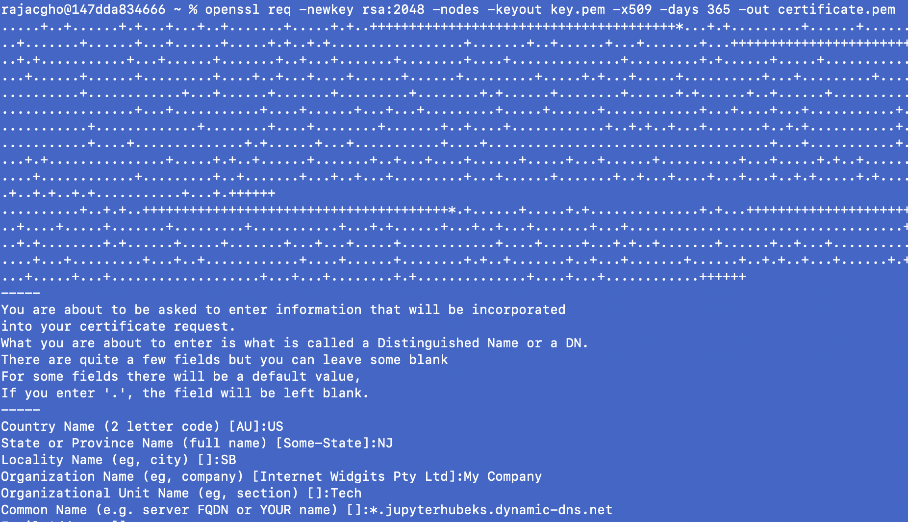
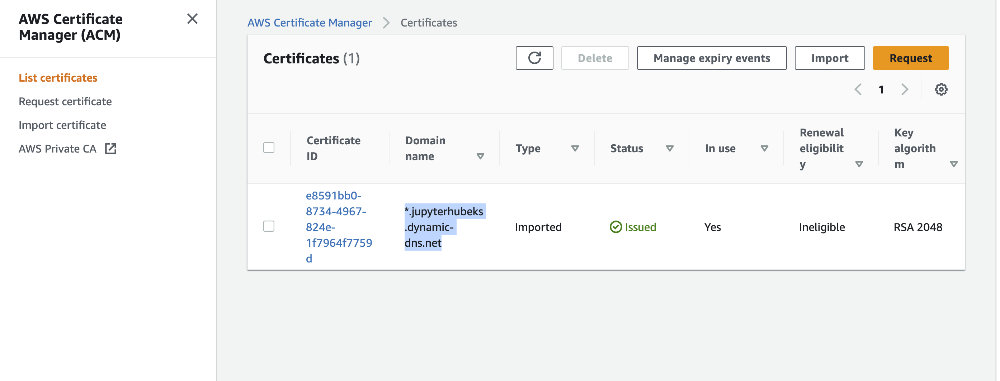
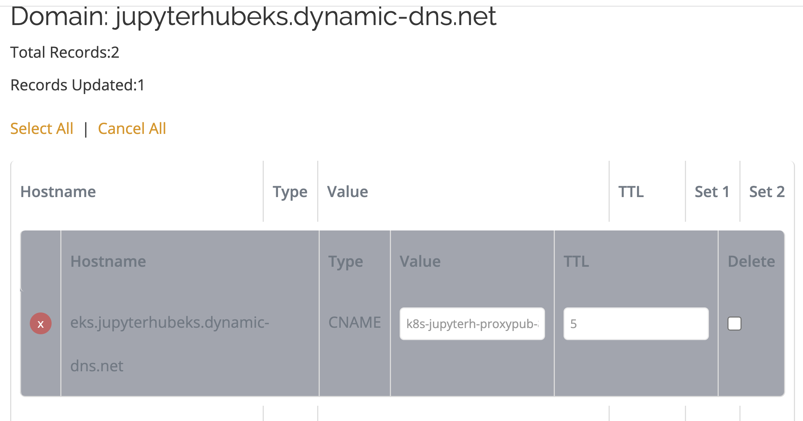
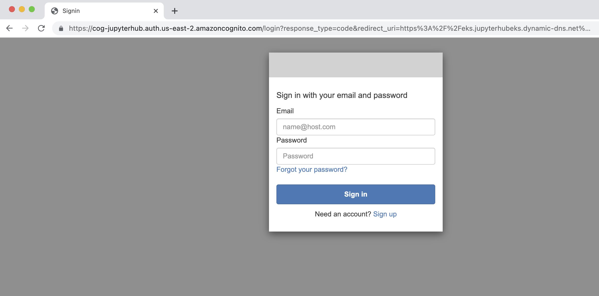

import CollapsibleContent from '../../../src/components/CollapsibleContent';

# JupyterHub on EKS

::info
Note: We are actively working on enhancing this blueprint with additional functionalities to make it more enterprise-ready.
:::

## Introduction
[JupyterHub](https://jupyter.org/hub) is a powerful multi-user server that enables users to access and interact with Jupyter notebooks and other Jupyter-compatible environments. It provides a collaborative platform where multiple users can simultaneously access and utilize notebooks, fostering collaboration and sharing among users. JupyterHub allows users to create their own isolated computing environments (known as "spawners") and launch Jupyter notebooks or other interactive computing environments within those environments. This provides each user with their own workspace, including files, code, and computational resources.

## JupyterHub on EKS
JupyterHub on Amazon Elastic Kubernetes Service (EKS) combines the versatility of JupyterHub with the scalability and flexibility of Kubernetes. By deploying JupyterHub on EKS, you can easily manage and maintain a shared Jupyter notebook environment for multiple users. This environment serves as a collaborative and interactive platform for various tasks such as data science, machine learning, and research. The JupyterHub add-on is built upon the JupyterHub project, which supports a multi-user Hub capable of spawning, managing, and proxying multiple instances of single-user Jupyter notebook servers.

By leveraging the capabilities of EKS, you can seamlessly scale your JupyterHub environment to meet the needs of your users, ensuring efficient resource utilization and optimal performance. With EKS, you can take advantage of Kubernetes features such as automated scaling, high availability, and easy deployment of updates and upgrades. This enables you to provide a reliable and robust JupyterHub experience for your users, empowering them to collaborate, explore, and analyze data effectively.
To get started with JupyterHub on EKS, follow the instructions in this guide to set up and configure your JupyterHub environment.


<CollapsibleContent header={<h3><span>Deploying the Solution</span></h3>}>

This [blueprint](https://github.com/awslabs/data-on-eks/tree/main/ai-ml/jupyterhub)  deploys the following components:

- Creates a new sample VPC, 2 Private Subnets, and 2 Public Subnets. Link to VPC documentation
- Sets up an Internet gateway for Public Subnets and NAT Gateway for Private Subnets.
- Creates an EKS Cluster Control plane with a public endpoint (for demo purposes only) and a core managed node group.
- Deploys the [JupyterHub Helm chart](https://hub.jupyter.org/helm-chart/) to set up JupyterHub.
- Exposes the JupyterHub proxy using an AWS Network Load Balancer.
- Deploys the EBS CSI driver add-on to enable the use of EBS persistent storage for the EKS data plane.
- Sets up two EFS storage mounts: one for personal storage and one for shared storage.
- Authenticates users using [Amazon Cognito](https://aws.amazon.com/cognito/) user pools. Link to Cognito documentation

By following this blueprint, you can easily deploy and configure a JupyterHub environment on EKS, leveraging various AWS services to provide a collaborative and scalable platform for your users.

<CollapsibleContent header={<h3><span>Pre-requisites</span></h3>}>

Ensure that you have installed the following tools on your machine.

1. [aws cli](https://docs.aws.amazon.com/cli/latest/userguide/install-cliv2.html)
2. [kubectl](https://Kubernetes.io/docs/tasks/tools/)
3. [terraform](https://learn.hashicorp.com/tutorials/terraform/install-cli)
4. **Domain Name**: You need to bring your own domain name to host the JupyterHub WebUI with a custom domain. For testing purposes, you can use a free domain service provider such as [ChangeIP](https://www.changeip.com/accounts/index.php) to create a test domain. However, please note that using ChangeIP or similar services for hosting your production or development clusters with JupyterHub is not recommended. Ensure that you review the terms and conditions of using such services.
5. **SSL Certificate**: You will also need to obtain an SSL certificate from a trusted Certificate Authority (CA) or through your web hosting provider to attach to the domain. For testing environments, you can generate a self-signed certificate using the OpenSSL service.

```bash
openssl req -newkey rsa:2048 -nodes -keyout key.pem -x509 -days 365 -out certificate.pem
```

When creating the certificate use a wildcard, so that it can secure a domain and all its subdomains with a single certificate
The service generates the private key and self-signed certificate.
Sample prompts to generate a certificate :




6. Import the certificate into AWS Certificate Manager

Open the private key(`key.pem`) in a text editor and copy the contents into the private key section of ACM. Similarly, copy the contents of the `certificate.pem` file into the certificate body section and submit.

   

   Verify certificate is installed correctly in the console in ACM.

   

</CollapsibleContent>

### Deploy

Clone the repository

```bash
git clone https://github.com/awslabs/data-on-eks.git
```

Navigate into one of the blueprint directory

```bash
cd data-on-eks/ai-ml/jupyterhub && chmod +x install.sh
```

#### Run the install script

Use the provided helper script `install.sh` to run the terraform init and apply commands. By default the script deploys EKS cluster to `us-west-2` region. Update `variables.tf` to change the region or other variables.

:::info
Please note that during the execution of this script, you will be prompted to provide input values for 'Certificate Domain'(`acm_certificate_domain`) and 'Sub-domain(`jupyterhub_domain`) for JupyterHub'.

For 'Certificate Domain', please provide the wildcard root domain for which the SSL certificate has been imported into AWS Certificate Manager (ACM). An example of this could be `*.jupyterhubeks.dynamic-dns.net`.

Regarding the 'Sub-domain for JupyterHub', please provide the fully qualified domain name (FQDN) where you want to host your JupyterHub. For instance, you can use eks.`eks.jupyterhubeks.dynamic-dns.net` as the sub-domain.

Make sure to provide the appropriate values for these inputs when prompted.
:::


```bash
./install.sh
```

</CollapsibleContent>

<CollapsibleContent header={<h3><span>Verify the resources</span></h3>}>
To validate that the JupyterHub add-on is running ensure that the add-on deployments for the controller and the webhook are in RUNNING state.

Run the following command

```bash
kubectl get pods -n jupyterhub
```


JupyterHub, by default, creates a proxy service called proxy-public which is exposed by Load Balancer.

To validate that the proxy service and running and exposed via LoadBalancer.  

Run the following command

```bash
kubectl get svc -n jupyterhub
```


</CollapsibleContent>

### Login into JupyterHub via Amazon Cognito

Add the `CNAME` DNS record in ChangeIP for the JupyterHub domain with the load balancer DNS name.



:::info
When adding the load balancer DNS name in the value field of CNAME in ChangeIP make sure to add a dot(`.`) at the end of the load-balancer DNS name.
:::

Now typing the domain url in the browser should redirect to the Cognito login page.


Follow the Cognito sign-up and sign-in process to login.



Successful sign-in will open up the JupyterHub environment for the logged in user.


To test the setup of the shared and personal directories in JupyterHub, you can follow these steps:
1. Open a terminal window from the launcher dashboard.


2.  execute the command

```bash
df -h
```
Verify EFS mounts created. Each user's private home directory is available at `/home/jovyan`. The shared directory is available at `/home/shared`


<CollapsibleContent header={<h3><span>Cleanup</span></h3>}>

:::caution
To avoid unwanted charges to your AWS account, delete all the AWS resources created during this deployment.
:::

This script will cleanup the environment using -target option to ensure all the resources are deleted in correct order.

```bash
cd data-on-eks/ai-ml/jupyterhub/ && chmod +x cleanup.sh
./cleanup.sh
```

</CollapsibleContent>
