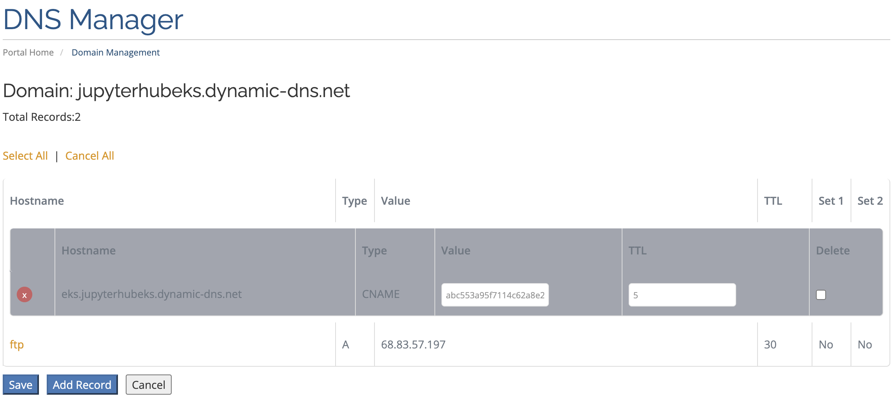
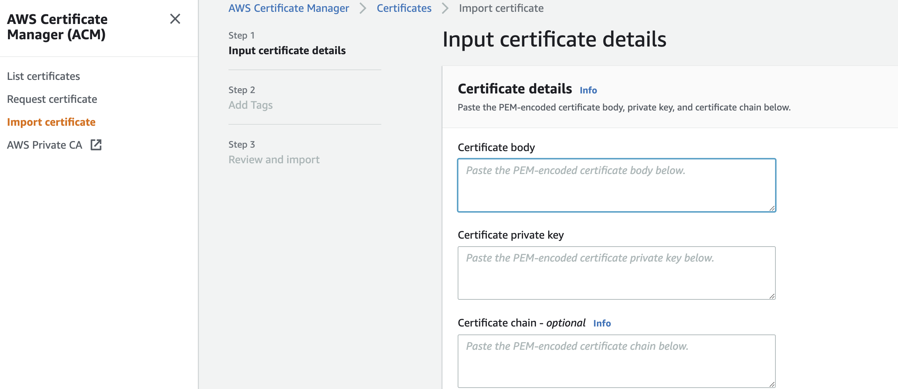

import CollapsibleContent from '../../../src/components/CollapsibleContent';

# JupyterHub on EKS


## Introduction

[JupyterHub](https://jupyter.org/hub) is a multi-user server that allows users to access and interact with Jupyter notebooks and other Jupyter-compatible environments. It is a web application that enables the deployment of Jupyter notebooks on a server, allowing multiple users to access and use notebooks simultaneously.
JupyterHub is designed to facilitate collaboration and sharing among users. It provides a central hub where users can log in, create their own isolated computing environments (known as "spawners"), and launch Jupyter notebooks or other interactive computing environments within those environments. Each user can have their own workspace, which includes their files, code, and computational resources.

### JupyterHub on AWS

JupyterHub on Amazon Elastic Kubernetes Service (EKS) combines the power of JupyterHub, a multi-user environment for interactive computing, with the scalability and flexibility of Kubernetes. With JupyterHub on EKS, you can easily deploy and manage a shared Jupyter notebook environment for multiple users, providing them with a collaborative and interactive platform for data science, machine learning, and research.
JupyterHub add-on is based on the [JupyterHub](https://github.com/jupyterhub/jupyterhub) project that supports a multi-user Hub to spawn, manage, and proxy multiple instances of single user Jupyter notebook server.

This [blueprint](https://github.com/awslabs/data-on-eks/tree/main/ai-ml) deploys the follwing:

1. Deploys the [JupyterHub helm chart](https://hub.jupyter.org/helm-chart/) for Helm chart version 2.0.0 that deploys JupyterHub version 3.0.0 in jupyterhub namespace by default.
2. Expose JupyterHub proxy using AWS Load Balancer.
3. Deploys EBS CSI driver add-on to leverage EBS persistent storage for the EKS data plane.
4. Deploys 2 EFS storage mounts. One for personal storage and one for shared storage.
5. Authenticate users via [AWS Cognito](https://aws.amazon.com/cognito/) user pools.


<CollapsibleContent header={<h3><span>Pre-requisites</span></h3>}>

Ensure that you have installed the following tools on your machine.

1. [aws cli](https://docs.aws.amazon.com/cli/latest/userguide/install-cliv2.html)
2. [kubectl](https://Kubernetes.io/docs/tasks/tools/)
3. [terraform](https://learn.hashicorp.com/tutorials/terraform/install-cli)
4. Domain for hosting: For testing, use any free domain service provider. I have used [changeip](https://www.changeip.com/accounts/index.php) to create a domain.
   After domain creation, navigate to the DNS manager and create a sub-domain for hosting the jupyterhub.
   The sub-domains CNAME record would need to be updated to the JupyterHub Load Balancer url which is mentioned in the deployment steps.

      

5. Also, you need to obtain an SSL certificate from a trusted Certificate Authority (CA) or through your web hosting provider to attach to the domain.
   For testing environments we can use a self-signed certificate.
   You can use the openssl service to create a self-signed certificate.

    ```bash
    openssl req -newkey rsa:2048 -nodes -keyout key.pem -x509 -days 365 -out certificate.pem
    ```
    When installing the certificate use the sub-domain which is registered with the DNS service in the above step.
    The service generates the private key and self-signed certificate.

6. Import the certificate into AWS Certificate Manager.
   Open the private key(key.pem) in a text editor and copy the contents into the private key section of ACM.
   Simmilarly, copy the contents of the certificate.pem file into the certificate body section and submit.

     

</CollapsibleContent>
<CollapsibleContent header={<h3><span>Deploy the EKS Cluster with JupyterHub add-on.</span></h3>}>

### Deploy

Clone the repository

```bash
git clone https://github.com/awslabs/data-on-eks.git
```

Navigate into one of the blueprint directory

```bash
cd data-on-eks/ai-ml/jupyterhub
```
Run the install script

Use the provided helper script `install.sh` to run the terraform init and apply commands. By default the script deploys EKS cluster to `us-west-2` region. Update `variables.tf` to change the region or other variables.

:::info
Please note that this script will asks for an input value for `var.acm_certificate_domain`. You need to this to deploy the blueprint. Checkout the pre-requisite scripts
:::

```bash
./install.sh
```

</CollapsibleContent>

<CollapsibleContent header={<h3><span>Verify Deployment</span></h3>}>
To validate that the JupyterHub add-on is running ensure that the add-on deployments for the controller and the webhook are in RUNNING state.

Run the following command

```bash
kubectl get pods -n jupyterhub
```


JupyterHub, by default, creates a proxy service called proxy-public which is exposed by Load Balancer.

To validate that the proxy service and running and exposed via LoadBalancer.  

Run the following command

```bash
kubectl get svc -n jupyterhub
```


</CollapsibleContent>

<CollapsibleContent header={<h3><span>Login into JupyterHub via Cognito</span></h3>}>

Update the CNAME DNS record of your domain with the load balancer url.
Now typing the domain url in the browser should redirect to the Cognito login page.


Follow the Cognito sign-up and sign-in process to login.


Successful sign-in will open up the JupyterHub environment for the logged in user.


To test the setup of the shared and personal directories in JupyterHub, you can follow these steps:
1. Open a terminal window from the launcher dashboard.


2.  execute the command

```bash
df -h
```
Verify EFS mounts created.  
Each user's private home directory is available at /home/jovyan  
The shared directory is available at /home/shared

</CollapsibleContent>

<CollapsibleContent header={<h3><span>Teardown</span></h3>}>

:::caution
To avoid unwanted charges to your AWS account, delete all the AWS resources created during this deployment.
:::

Use the provided helper script `cleanup.sh` to run the terraform init and apply commands.

```bash
./cleanup.sh
```

</CollapsibleContent>
