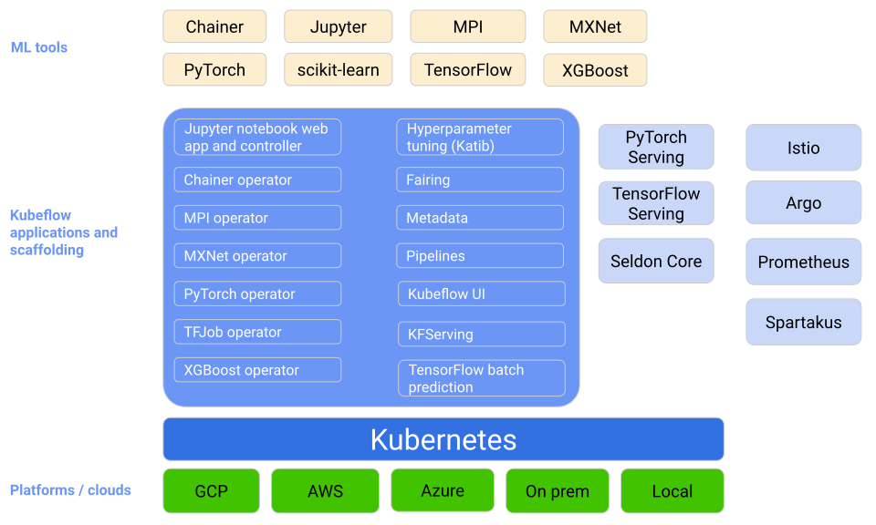
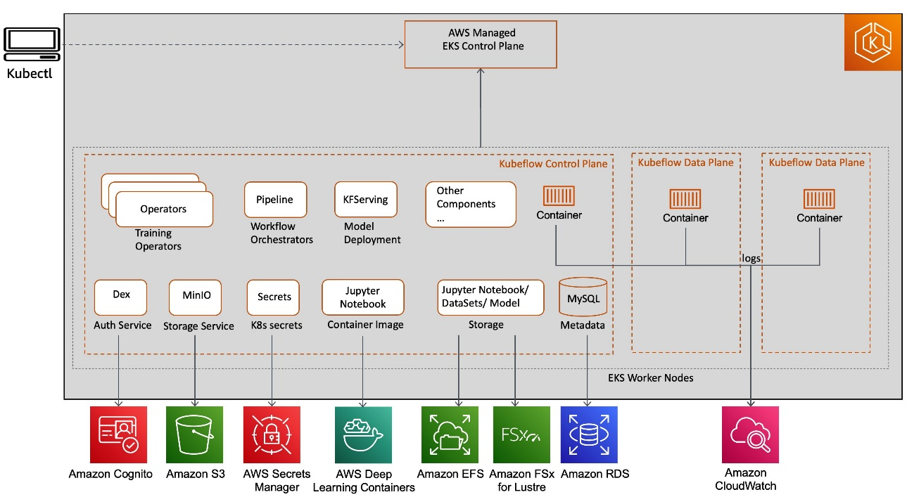

import CollapsibleContent from '../../../src/components/CollapsibleContent';

# Kubeflow on AWS

## Introduction

**Kubeflow on AWS** is an open source distribution of [Kubeflow](https://www.kubeflow.org/) that allows customers to build machine learning systems with ready-made AWS service integrations. Use **Kubeflow on AWS** to streamline data science tasks and build highly reliable, secure, and scalable machine learning systems with reduced operational overheads.

The open source repository for the **Kubeflow on AWS** distribution is available under [awslabs](https://github.com/awslabs/kubeflow-manifests) GitHub organization.

## Kubeflow

Kubeflow is the machine learning toolkit for Kubernetes. It provides a set of tools that enable developers to build, deploy, and manage machine learning workflows at scale. The following diagram shows Kubeflow as a platform for arranging the components of your ML system on top of Kubernetes:

*Source: https://www.kubeflow.org/docs/started/architecture/*

## AWS Features for Kubeflow

### Architecture

*Source: https://aws.amazon.com/blogs/machine-learning/build-and-deploy-a-scalable-machine-learning-system-on-kubernetes-with-kubeflow-on-aws/*

Running **Kubeflow on AWS** gives you the following feature benefits and configuration options:

### Manage AWS compute environments

* Provision and manage your Amazon Elastic Kubernetes Service (EKS) clusters with eksctl and easily configure multiple compute and GPU node configurations.
* Use AWS-optimized container images, based on [AWS Deep Learning Containers](https://docs.aws.amazon.com/deep-learning-containers/latest/devguide/what-is-dlc.html), with Kubeflow Notebooks.

### CloudWatch Logs and Metrics

* Integrate **Kubeflow on AWS** with [Amazon CloudWatch](https://aws.amazon.com/cloudwatch/) for persistent logging and metrics on EKS clusters and Kubeflow pods.
* Use [AWS Container Insights](https://docs.aws.amazon.com/AmazonCloudWatch/latest/monitoring/ContainerInsights.html) to collect, aggregate, and summarize metrics and logs from your containerized applications and microservices.

### Load balancing, certificates, and identity management

* Manage external traffic with [AWS Application Load Balancer](https://docs.aws.amazon.com/elasticloadbalancing/latest/application/introduction.html).
* Get started with TLS authentication using [AWS Certificate Manager](https://aws.amazon.com/certificate-manager/) and [AWS Cognito](https://aws.amazon.com/cognito/).

### AWS database and storage solutions

* Integrate Kubeflow with [Amazon Relational Database Service (RDS)](https://aws.amazon.com/rds/) for a highly scalable pipelines and metadata store.
* Deploy Kubeflow with integrations for [Amazon S3](https://aws.amazon.com/s3/) for an easy-to-use pipeline artifacts store.
* Use Kubeflow with [Amazon Elastic File System (EFS)](https://aws.amazon.com/efs/) for a simple, scalabale, and serverless storage solution.
* Leverage the [Amazon FSx CSI driver](https://github.com/kubernetes-sigs/aws-fsx-csi-driver) to manage Lustre file systems which are optimized for compute-intensive workloads, such as high-performance computing and machine learning. [Amazon FSx for Lustre](https://aws.amazon.com/fsx/lustre/) can scale to hundreds of GBps of throughput and millions of IOPS.

### Integrate with Amazon SageMaker

* Use **Kubeflow on AWS** with [Amazon SageMaker](https://aws.amazon.com/sagemaker/) to create hybrid machine learning workflows.
* Train, tune, and deploy machine learning models in Amazon SageMaker without logging into the SageMaker console using [SageMaker Operators for Kubernetes (ACK)](https://github.com/aws-controllers-k8s/sagemaker-controller).
* Create a [Kubeflow Pipeline](https://www.kubeflow.org/docs/components/pipelines/v1/introduction/#what-is-kubeflow-pipelines) built entirely using [SageMaker Components for Kubeflow Pipelines](https://github.com/kubeflow/pipelines/tree/master/components/aws/sagemaker), or integrate individual components into your workflow as needed.

## Deployment

:::caution
Terraform deployment options mentioned below are still in preview.
:::

:::caution
Please make sure to visit the [version compability](https://awslabs.github.io/kubeflow-manifests/docs/about/eks-compatibility/) page to ensure the Kubeflow version you are planning to run is compatible with the EKS version.
:::

**Kubeflow on AWS** can be deployed on an existing EKS cluster using Kustomize or Helm. Additionally, terraform templates are also made available if an EKS cluster is not available and needs to be created. AWS provides various Kubeflow deployment options:

* [Vanilla deployment](https://awslabs.github.io/kubeflow-manifests/docs/deployment/vanilla/)
* [Deployment with Amazon RDS and Amazon S3](https://awslabs.github.io/kubeflow-manifests/docs/deployment/rds-s3/)
* [Deployment with Amazon Cognito](https://awslabs.github.io/kubeflow-manifests/docs/deployment/cognito/)
* [Deployment with Amazon Cognito, Amazon RDS, and Amazon S3](https://awslabs.github.io/kubeflow-manifests/docs/deployment/cognito-rds-s3/)

Please visit the [deployment](https://awslabs.github.io/kubeflow-manifests/docs/deployment/) documentation on the **Kubeflow on AWS** website for the deployment options available and steps for each of those options.
