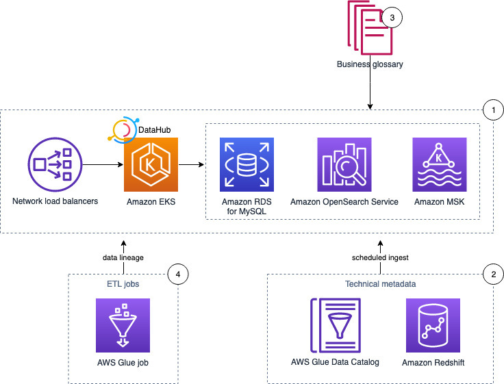
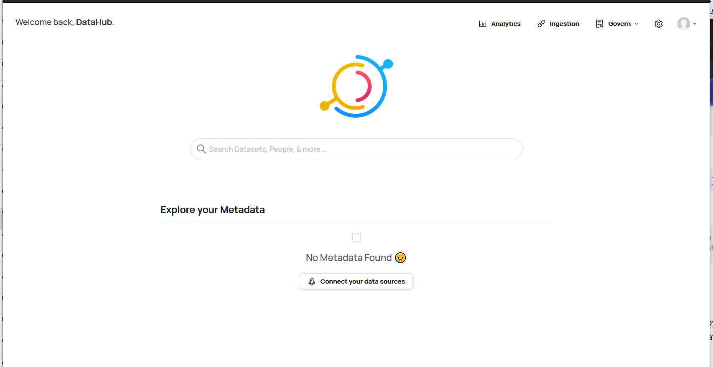

# DataHub on EKS

## Introduction
DataHub is an open source data catalog that enables end-to-end data discovery, data observability, and data governance.  This extensive metadata platform allows users to collect, store, and explore metadata from various sources, such as databases, data lakes, streaming platforms, and ML feature stores.   DataHub provides many [features](https://datahubproject.io/docs/features/), a rich UI for searching and browsing metadata, as well as an API for integrating with other applications. 

This [blueprint](https://github.com/awslabs/data-on-eks/tree/main/analytics/terraform/datahub-on-eks) deploys DataHub on an EKS cluster, using Amazon OpenSearch Service, Amazon Managed Streaming for Apache Kafka (Amazon MSK), and Amazon RDS for MySQL as the storage layer for the underlying data model and indexes. 

## DataHub on AWS

On AWS, DataHub can run on EKS cluster.  By using EKS, you can leverage the power and flexibility of Kubernetes to deploy and scale DataHub components, and take advantage of other AWS services and features, such as IAM, VPC, and CloudWatch, to monitor and secure the DataHub cluster.   

DataHub also depends on many underlying infrastructure and services to function, including a message broker, a search engine, graph database, and a relational database like MySQL or PostgreSQL.  AWS offers a range of managed and serverless services that can meet the needs of DataHub and simplify its deployment and operation. 

1. DataHub can use Amazon Managed Streaming for Apache Kafka (MSK) as the messaging layer for metadata ingestion and consumption.  MSK is a fully managed Apach Kakfa service, so you don't need to handles the provisioning, configuration, and maintenance of Kafka cluster. 
2. DataHub stores metadata in both relational database and a search engine.  For the relational database, this blueprint uses Amazon RDS for MySQL, which is also a managed service that simplifies the setup and operation of MySQL databases.  RDS for MySQL also provides the high availability, security, and other features DataHub needs to store the metadata.
3. For search engine, this blueprint uses Amazon OpenSearch service to provide fast and scalable search capabilities for the metadata.   
4. This blueprint deployes a Schema Registry service on EKS for DataHub.  You may also choose to use Glue Schema Registry (https://docs.aws.amazon.com/glue/latest/dg/schema-registry.html) instead.  Support for Glue Schema Registry will be included in future release of this blueprint.



## Deploying the Solution

This blueprint deploys an EKS Cluster into a new VPC.

- Creates a new sample VPC, 2 Private Subnets and 2 Public Subnets
- Creates Internet gateway for Public Subnets and NAT Gateway for Private Subnets
- Creates EKS Cluster Control plane with public endpoint (for demo reasons only) with core managed node group, on-demand node group and Spot node group for Spark workloads.
- Deploys Metrics server, Cluster Autoscaler, Prometheus server and AMP workspace, and AWS LoadBalancer Controller. 

It then provisions the storage services for DataHub.

- Creates service-linked role, security group, and an OpenSearch domain with one data node in each of the private subnets / AZs that EKS cluster is deployed on.
- Creates security group, kms key, and configuration for MSK.  Creates the MSK cluster with one broker in each of the private subnets.
- Creates an RDS MySQL db instance with multi-AZ enabled.

Finally it deployes the datahub-prerequisites and datahub helm charts to setup the datahub pods / services on the EKS cluster.  Ingress is enabled (as configured in datahub_values.yaml) and AWS LoadBalancer Controller will provision an ALB to expose the DataHub frontend UI.

:::info
You may customize the blueprint by changing values in `variables.tf`, to deploy to a different region (default to `us-west-2` ), use different cluster name, number of subnets / AZs, or disable addons like fluentbit
:::

:::info
If you already have opensearch service in the account, the service-linked role for OpenSearch exists already.  You will need to change default value for variable `create_iam_service_linked_role_es` to `false` to avoid error in deployment. 
:::

### Prerequisites

Ensure that you have installed the following tools on your machine.

1. [aws cli](https://docs.aws.amazon.com/cli/latest/userguide/install-cliv2.html)
2. [kubectl](https://Kubernetes.io/docs/tasks/tools/)
3. [terraform](https://learn.hashicorp.com/tutorials/terraform/install-cli)

### Deploy

Clone the repository

```bash
git clone https://github.com/awslabs/data-on-eks.git
```

Navigate into one of the example directories and run `install.sh` script

```bash
cd data-on-eks/analytics/terraform/datahub-on-eks
chmod +x install.sh
./install.sh
```

:::caution
`install.sh` script runs `terraform apply -target` for each module in order.  The module dependencies are configured so they will be applied in the right sequence when you just run `terraform apply`.  However, provisioning addons and MSK, OpenSearch, and RDS instances often take longer than 15 minutes, causing error when provisioning kubernetes and helm resources/modules afterwards due to expired auth token.  So if you use `terraform apply` instead running `install.sh`, you may need to run it multiple times and terraform will resume the failed resource with a new token each time and complete the deployment eventually.
:::


### Verify Deployment

After the deployment completes, we can access the DataHub UI and test importing metadata from sample datasources.  For demo purpose, this blueprint creates the Ingress object for the datahub FrontEnd UI with public LoadBalancer(internet-facing).  For production workloads, you can modify datahub_values.yaml to use internal LB:

```
datahub-frontend:
  enabled: true
  image:
    repository: linkedin/datahub-frontend-react
  # Set up ingress to expose react front-end
  ingress:
    enabled: true
    annotations:
      kubernetes.io/ingress.class: alb
      alb.ingress.kubernetes.io/scheme: **internet-facing**
      alb.ingress.kubernetes.io/target-type: instance
```

You may find the URL to the datahub frontend from the output `frontend_url`, or by running kubectl command below:

```sh
kubectl get ingress datahub-datahub-frontend -n datahub

# OUTPUT should looks like below
NAME                       CLASS    HOSTS   ADDRESS                                                                 PORTS   AGE
datahub-datahub-frontend   <none>   *       k8s-datahub-datahubd-xxxxxxxxxx-xxxxxxxxxx.<region>.elb.amazonaws.com   80      nn
```

Copy the ADDRESS field from the output, then open browser and enter the URL as `http://<address>/`. Enter `datahub` as both user name and password when prompted.  We can view the DataHub UI like below.



## Testing

Follow steps from this [blog](https://aws.amazon.com/blogs/big-data/part-2-deploy-datahub-using-aws-managed-services-and-ingest-metadata-from-aws-glue-and-amazon-redshift/) to populate metadata from AWS Glue Data Catalog and Amazon Redshift, and business glossary and data lineage, into DataHub. 

## Cleanup

To clean up your environment, run the `cleanup.sh` script.script

```bash
chmod +x cleanup.sh
./cleanup.sh
```

