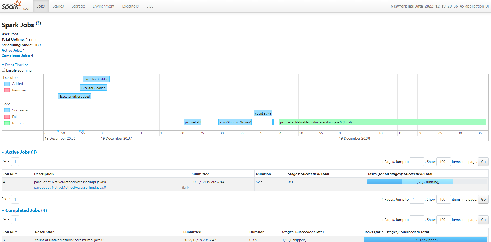
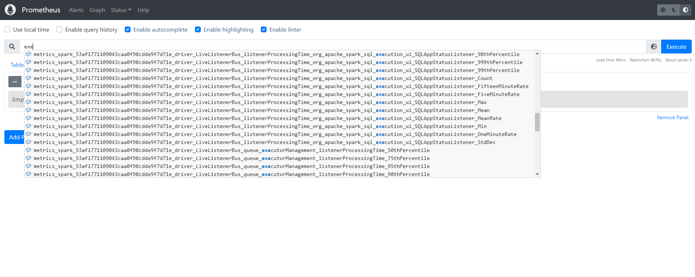

# Observability Spark on EKS

## Introduction
In this post, we will learn the Observability for Spark on EKS. We will use Spark History Server to watch Spark Applications logs and check the Spark job progress via the Spark Web UI. Amazon Managed Service for Prometheus is used to collect and store the metrics generated by Spark Applications and Grafana is used to build dashboards for monitoring use cases.

## Deploying the Solution
We will reuse the previous Spark on Operator example. Please follow [this link](https://awslabs.github.io/data-on-eks/docs/data-analytics/spark-operator-yunikorn#deploying-the-solution) to provision resources


## Set up data and py script
let's navigate to one example folder under spark-k8s-operator and run the shell script to upload data and py script to the S3 bucket created by terraform above.
```bash
cd data-on-eks/analytics/terraform/spark-k8s-operator/examples/cluster-autoscaler/nvme-ephemeral-storage

# replace <S3_BUCKET> with your S3 bucket and <REGION> with your region, then run
./taxi-trip-execute.sh
```

## Spark Web UI
When you submit a Spark application, Spark context is created which ideally gives you [Spark Web UI](https://sparkbyexamples.com/spark/spark-web-ui-understanding/) to monitor the execution of the application. Monitoring includes the following.
- Spark configurations used
- Spark Jobs, stages, and tasks details
- DAG execution
- Driver and Executor resource utilization
- Application logs and many more <br/>

When your application is done with the processing, Spark context will be terminated so your Web UI as well. and if you wanted to see the monitoring for already finished application, we cannot do it.

To try Spark web UI, let's update <S3_BUCKET> with your bucket name and <JOB_NAME> with "nvme-taxi-trip" in nvme-ephemeral-storage.yaml

```bash
  kubectl apply -f nvme-ephemeral-storage.yaml
```

Then run port forward command to expose spark web service.

```bash
kubectl port-forward po/taxi-trip 4040:4040 -nspark-team-a
```

Then open browser and enter localhost:4040. You can view your spark application like below.



## Spark History Server
As mentioned above, spark web UI will be terminated once the spark job is done. This is where Spark history Server comes into the picture, where it keeps the history (event logs) of all completed applications and its runtime information which allows you to review metrics and monitor the application later in time.

In this example, we installed Spark history Server to read logs from S3 bucket. In your spark application yaml file, make sure you have the following setting:

    sparkConf:
        "spark.hadoop.fs.s3a.aws.credentials.provider": "com.amazonaws.auth.InstanceProfileCredentialsProvider"
        "spark.hadoop.fs.s3a.impl": "org.apache.hadoop.fs.s3a.S3AFileSystem"
        "spark.eventLog.enabled": "true"
        "spark.eventLog.dir": "s3a://<your bucket>/logs/"

Run port forward command to expose spark-history-server service.
```bash
kubectl port-forward services/spark-history-server 18085:80 -n spark-history-server
```

Then open browser and enter localhost:18085. You can view your spark history server like below.


## Prometheus
Spark users must add the following config to spark application yaml file to extract the metrics from Spark Driver and Executors. In the example, they are added into nvme-ephemeral-storage.yaml already.

    "spark.ui.prometheus.enabled": "true"
    "spark.executor.processTreeMetrics.enabled": "true"
    "spark.kubernetes.driver.annotation.prometheus.io/scrape": "true"
    "spark.kubernetes.driver.annotation.prometheus.io/path": "/metrics/executors/prometheus/"
    "spark.kubernetes.driver.annotation.prometheus.io/port": "4040"
    "spark.kubernetes.driver.service.annotation.prometheus.io/scrape": "true"
    "spark.kubernetes.driver.service.annotation.prometheus.io/path": "/metrics/driver/prometheus/"
    "spark.kubernetes.driver.service.annotation.prometheus.io/port": "4040"
    "spark.metrics.conf.*.sink.prometheusServlet.class": "org.apache.spark.metrics.sink.PrometheusServlet"
    "spark.metrics.conf.*.sink.prometheusServlet.path": "/metrics/driver/prometheus/"
    "spark.metrics.conf.master.sink.prometheusServlet.path": "/metrics/master/prometheus/"
    "spark.metrics.conf.applications.sink.prometheusServlet.path": "/metrics/applications/prometheus/"

Run port forward command to expose prometheus service.
```bash
kubectl  port-forward service/prometheus-server   8080:80 -n prometheus
```

Then open browser and enter localhost:8080. You can view your prometheus server like below.


## Grafana
Grafana has been installed. Use the command below to access with port forward.

# get grafana password

```bash
kubectl  port-forward service/grafana 8080:80 -n grafana  
```

login username is admin and password can get from secrets manager. You can import dashboard with ID: 7890.


