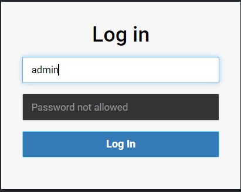
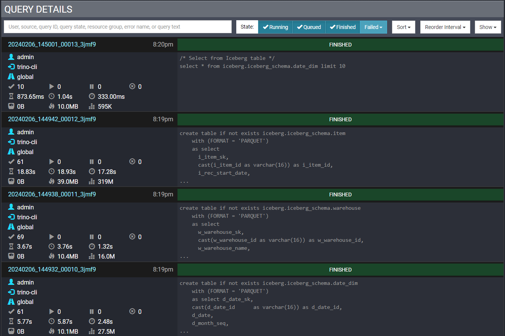

# Deploying Trino on EKS

## Introduction

**Trino** is an [open source query engine](https://trino.io/) designed to run distributed SQL query engine for data analytics.

It defines a new Kubernetes resource called `Cluster` representing a Trino cluster consisting of a coordinator and many workers (for high availability) as k8s pods. The coordinator and the workers collaborate to access connected data sources, with schemas and references stored in a catalog. To access the data sources, you can use one of the many [connectors](https://trino.io/docs/current/connector.html) provided by Trino to adapt Trino. Examples include as Hive, Iceberg, and Kafka.

More details about the project will be found on this [link](https://trino.io)

## Blueprint Solution

This blueprint will deploy Trino on an EKS cluster with nodes provisioned using Karpenter. To optimize on cost and performance, Karpenter will provision on-demand nodes for the coordinator and spot instances for the workers. Trino is deployed using the official Helm chart, with custom values provided for users to leverage either Hive or Iceberg as the connector. The examples will use Glue or Iceberg tables on AWS as the backend data source, using S3 as the storage.

## Deploying the Solution

Let's go through the deployment steps.

### Prerequisites

Ensure that you have installed the following tools on your machine.

1. [aws cli](https://docs.aws.amazon.com/cli/latest/userguide/install-cliv2.html)
2. [kubectl](https://Kubernetes.io/docs/tasks/tools/)
3. [terraform](https://learn.hashicorp.com/tutorials/terraform/install-cli)
4. [trino cli client](https://trino.io/docs/current/client/cli.html)

### Deploy the EKS Cluster with Trino

First, clone the repository

```bash
git clone https://github.com/awslabs/data-on-eks.git
```

Navigate into `distributed-databases/trino` and run `install.sh` script. By default the script deploys EKS cluster to `us-west-2` region. Update `variables.tf` to change the region. This is also the time to update any other input variables or make any other changes to the terraform template.

```bash
cd data-on-eks/distributed-databases/trino

./install.sh
```

### Verify Deployment

Verify the Amazon EKS Cluster

```bash
aws eks describe-cluster --name trino-on-eks
```

Update local kubeconfig so we can access kubernetes cluster (you can also get this command from the terraform output `configure_kubectl`)

```bash
aws eks update-kubeconfig --name trino-on-eks --region us-west-2
```

First, lets verify that we have worker nodes provisioned by Karpenter in the cluster. Lets also show their availability zone and capacity type

```bash
kubectl get nodes --selector=NodePool=trino-karpenter -L topology.kubernetes.io/zone -L karpenter.sh/capacity-type
```
#### Output
```bash
NAME                                        STATUS   ROLES    AGE     VERSION               ZONE         CAPACITY-TYPE
ip-10-1-11-104.us-west-2.compute.internal   Ready    <none>   2d23h   v1.28.5-eks-5e0fdde   us-west-2b   spot
ip-10-1-11-235.us-west-2.compute.internal   Ready    <none>   2d23h   v1.28.5-eks-5e0fdde   us-west-2b   spot
ip-10-1-11-240.us-west-2.compute.internal   Ready    <none>   2d23h   v1.28.5-eks-5e0fdde   us-west-2b   spot
ip-10-1-11-60.us-west-2.compute.internal    Ready    <none>   3d      v1.28.5-eks-5e0fdde   us-west-2b   on-demand
```
We can see above that Karpenter launched 3 Spot nodes and 1 On-demand node in the same Availability Zone.
:::info

For Big Data query engine like Trino which runs on a massively parallel processing cluster of coordinator and workers, it is recommended to deploy and run the cluster in same AZ to avoid incurring high Inter-AZ Data Transfer costs. That's why Karpenter NodePool has been configured to launch EKS nodes in same AZ

:::

Now, lets verify all the pods (Trino coordinator and workers) that are running in `trino` namespace

```bash
kubectl get pods --namespace=trino
```
#### Output
```bash
NAME                                 READY   STATUS    RESTARTS      AGE
trino-coordinator-7c644cd9f5-j65ch   1/1     Running   0             24d
trino-worker-7f8565698-ctjr4         1/1     Running   0             13d
trino-worker-7f8565698-hhcwb         1/1     Running   0             24d
trino-worker-7f8565698-q4bvd         1/1     Running   1             24d
```
Next, lets retrieve the Application Load Balancer DNS created by blueprint using the following command:

```bash
export TRINO_UI_DNS=$(kubectl describe ingress --namespace=trino | grep Address: | awk '{ print "http://"$2 }')
echo $TRINO_UI_DNS
```
#### Output
```bash
http://k8s-trino-trinocoo-f64c9587b5-1356222439.us-west-2.elb.amazonaws.com
```

Now, lets access the Trino UI by pasting above Load Balancer DNS in a web browser. Login with username `admin` in the login window as shown below:



We can see Trino Web UI showing 3 active workers


## Using Trino for database querying executions

### Example #1: Using the Hive Connector

In this example, we will set up a Hive metastore using AWS Glue, with the source data stored in S3, and crawler that will infer schema from it to build a Glue table.

Using Trino on EKS with the Glue connector, we will use Trino CLI to run sample SQL queries to retrieve data.

#### Setup

Run the hive script from the `examples` directory to set up the blueprint S3 bucket with the 2022 NYC Taxi dataset (in Parquet), and build Glue metastore:

```bash
cd examples/
./hive.sh
```

You will see some outputs to show progress, and if successful, will see the name of the Glue table that will store the metadata as `hive`.

#### Running the queries
You should have the Trino CLI installed as part of the prerequisite. The blueprint has the Hive Connector configured with the bucket we set up in the previous section, so you should be able to query the data source without additional settings.

First, port-forward your trino coordinator pod to access it locally:
```
kubectl port-forward
```

In another terminal tab, while the port-forward is running, run the following command to access the coordinator:
```bash
./trino http://127.0.0.1:8080 --user admin
```

Once successful, you will be able to get a prompt to execute commands. You can use `help` command to see a list of supported commands.

For example:

To show a list of catalogs - `SHOW CATALOG`:

```bash
Catalog
---------
 hive
 system
 tpcds
 tpch
(4 rows)

Query 20231103_221729_00028_6dv3m, FINISHED, 1 node
Splits: 1 total, 1 done (100.00%)
0.21 [0 rows, 0B] [0 rows/s, 0B/s]
```

To show the Hive catalog schemas - `SHOW SCHEMAS FROM hive`:

```bash
  Schema
--------------------
 information_schema
 taxi_hive_database
(2 rows)
```

To show our Taxi table -
```
USE hive.taxi_hive_database
SHOW TABLES;
```

```
Table
-------
hive
(1 row)
```

Finally, to run a simple query to list items - `SELECT * FROM hive LIMIT 5`

```
vendorid |  tpep_pickup_datetime   |  tpep_dropoff_datetime  | passenger_count | trip_distance | ratecodeid | store_and_fwd_flag | pulocationid | dolocation>
----------+-------------------------+-------------------------+-----------------+---------------+------------+--------------------+--------------+----------->
        1 | 2022-09-01 00:28:12.000 | 2022-09-01 00:36:22.000 |             1.0 |           2.1 |        1.0 | N                  |          100 |          2>
        1 | 2022-11-01 00:24:49.000 | 2022-11-01 00:31:04.000 |             2.0 |           1.0 |        1.0 | N                  |          158 |          1>
        1 | 2022-11-01 00:37:32.000 | 2022-11-01 00:42:23.000 |             2.0 |           0.8 |        1.0 | N                  |          249 |          1>
        2 | 2022-09-01 00:02:24.000 | 2022-09-01 00:09:39.000 |             1.0 |          1.32 |        1.0 | N                  |          238 |          1>
        2 | 2022-09-01 00:47:25.000 | 2022-09-01 00:56:09.000 |             1.0 |          2.94 |        1.0 | N                  |
```

#### Clean Up

### Example #2: Using the Iceberg Connector

In this example, we will set up using Apache Iceberg with AWS Glue as the catalog type, and will store the data in Amazon S3 with PARQUET format. 

Using Trino on EKS with the Iceberg connector, we will use Trino CLI to create the above resources and run sample SQL queries to insert and retrieve data.

#### Setup

#### Running the queries

- Let's first find out the S3 data bucket created by blueprint. We will use this bucket to store data in Iceberg tables in PARQUET format. 
```bash
cd data-on-eks/distributed-databases/trino
terraform output --state="./terraform.tfstate" --raw data_bucket
```
#### Output
```bash
trino-data-bucket-4mnn
```

- Let’s now create an Iceberg schema with tables populated using sf10000 schema tables of [TPCDS](https://trino.io/docs/current/connector/tpcds.html) with CREATE TABLE AS SELECT (CTAS) statements. For that, let’s create a SQL file `trino_sf10000_tpcds_to_iceberg.sql` by copying below SQL statements 
##### (Also don't forget to replace S3 bucket name with your bucket from above command):
```bash
use tpcds.sf10000;
select * from tpcds.sf10000.item limit 10;
select * from tpcds.sf10000.warehouse limit 10;

/* Drop tables & schema */

drop schema iceberg.iceberg_schema;
drop table iceberg.iceberg_schema.warehouse;
drop table iceberg.iceberg_schema.item;
drop table iceberg.iceberg_schema.inventory;
drop table iceberg.iceberg_schema.date_dim;

/* Iceberg schema creation */

create schema if not exists iceberg.iceberg_schema
with (LOCATION = 's3://trino-data-bucket-4mnn/iceberg/');

/* Iceberg Table Creation with CTAS from tpcds tables */

create table if not exists iceberg.iceberg_schema.inventory
with (FORMAT = 'PARQUET')
as select *
from tpcds.sf10000.inventory;

create table if not exists iceberg.iceberg_schema.date_dim
with (FORMAT = 'PARQUET')
as select d_date_sk,
cast(d_date_id as varchar(16)) as d_date_id,
d_date,
d_month_seq,
d_week_seq,
d_quarter_seq,
d_year,
d_dow,
d_moy,
d_dom,
d_qoy,
d_fy_year,
d_fy_quarter_seq,
d_fy_week_seq,
cast(d_day_name as varchar(9)) as d_day_name,
cast(d_quarter_name as varchar(6)) as d_quarter_name,
cast(d_holiday as varchar(1)) as d_holiday,
cast(d_weekend as varchar(1)) as d_weekend,
cast(d_following_holiday as varchar(1)) as d_following_holiday,
d_first_dom,
d_last_dom,
d_same_day_ly,
d_same_day_lq,
cast(d_current_day as varchar(1)) as d_current_day,
cast(d_current_week as varchar(1)) as d_current_week,
cast(d_current_month as varchar(1)) as d_current_month,
cast(d_current_quarter as varchar(1)) as d_current_quarter
from tpcds.sf10000.date_dim;

create table if not exists iceberg.iceberg_schema.warehouse
with (FORMAT = 'PARQUET')
as select
w_warehouse_sk,
cast(w_warehouse_id as varchar(16)) as w_warehouse_id,
w_warehouse_name,
w_warehouse_sq_ft,
cast(w_street_number as varchar(10)) as w_street_number,
w_street_name,
cast(w_street_type as varchar(15)) as w_street_type,
cast(w_suite_number as varchar(10)) as w_suite_number,
w_city,
w_county,
cast(w_state as varchar(2)) as w_state,
cast(w_zip as varchar(10)) as w_zip,
w_country,
w_gmt_offset
from tpcds.sf10000.warehouse;

create table if not exists iceberg.iceberg_schema.item
with (FORMAT = 'PARQUET')
as select
i_item_sk,
cast(i_item_id as varchar(16)) as i_item_id,
i_rec_start_date,
i_rec_end_date,
i_item_desc,
i_current_price,
i_wholesale_cost,
i_brand_id,
cast(i_brand as varchar(50)) as i_brand,
i_class_id,
cast(i_class as varchar(50)) as i_class,
i_category_id,
cast(i_category as varchar(50)) as i_category,
i_manufact_id,
cast(i_manufact as varchar(50)) as i_manufact,
cast(i_size as varchar(50)) as i_size,
cast(i_formulation as varchar(20)) as i_formulation,
cast(i_color as varchar(20)) as i_color,
cast(i_units as varchar(10)) as i_units,
cast(i_container as varchar(10)) as i_container,
i_manager_id,
cast(i_product_name as varchar(50)) as i_product_name
from tpcds.sf10000.item;


/* Select from Iceberg table */

select * from iceberg.iceberg_schema.date_dim limit 10;
select * from iceberg.iceberg_schema.item limit 10;
select * from iceberg.iceberg_schema.inventory limit 10;

/* Running query from Iceberg table */

with inv as
(select w_warehouse_name,w_warehouse_sk,i_item_sk,d_moy
,stdev,mean, case mean when 0 then null else stdev/mean end cov
from(select w_warehouse_name,w_warehouse_sk,i_item_sk,d_moy
,stddev_samp(inv_quantity_on_hand) stdev,avg(inv_quantity_on_hand) mean
from iceberg.iceberg_schema.inventory
,iceberg.iceberg_schema.item
,iceberg.iceberg_schema.warehouse
,iceberg.iceberg_schema.date_dim
where inv_item_sk = i_item_sk
and inv_warehouse_sk = w_warehouse_sk
and inv_date_sk = d_date_sk
and d_year =1999
group by w_warehouse_name,w_warehouse_sk,i_item_sk,d_moy) foo
where case mean when 0 then 0 else stdev/mean end > 1)
select inv1.w_warehouse_sk,inv1.i_item_sk,inv1.d_moy,inv1.mean, inv1.cov
,inv2.w_warehouse_sk,inv2.i_item_sk,inv2.d_moy,inv2.mean, inv2.cov
from inv inv1,inv inv2
where inv1.i_item_sk = inv2.i_item_sk
and inv1.w_warehouse_sk = inv2.w_warehouse_sk
and inv1.d_moy=4
and inv2.d_moy=4+1
and inv1.cov > 1.5
order by inv1.w_warehouse_sk,inv1.i_item_sk,inv1.d_moy,inv1.mean,inv1.cov,inv2.d_moy,inv2.mean, inv2.cov;
```

- Above SQL commands will execute following actions:
    - Create an Iceberg schema named `iceberg_schema` 
    - Create 4 Iceberg tables - `warehouse`, `item`, `inventory` and `date_dim` with data from same tables of tpcds 
    - Query data from above Iceberg tables

- Let's now execute above SQL commands using Trino CLI:
```bash
export TRINO_UI_DNS=$(kubectl describe ingress --namespace=trino | grep Address: | awk '{ print "http://"$2 }')
./trino --file 'trino_sf10000_tpcds_to_iceberg.sql' --server ${TRINO_UI_DNS} --user admin --ignore-errors
```

- You can see completed and running SQL queries in Trino UI web monitor as below:



- Let’s also see how Horizontal Pod Autoscaler (HPA) is scaling Trino worker pods, when above SQL commands are running:
```bash
kubectl get hpa -n trino -w
```
#### Output
```bash
NAME           REFERENCE                 TARGETS   MINPODS   MAXPODS   REPLICAS   AGE
trino-worker   Deployment/trino-worker   0%/70%    3         20        3          3d2h
trino-worker   Deployment/trino-worker   0%/70%    3         20        3          3d2h
trino-worker   Deployment/trino-worker   170%/70%   3         20        3          3d2h
trino-worker   Deployment/trino-worker   196%/70%   3         20        6          3d2h
trino-worker   Deployment/trino-worker   197%/70%   3         20        9          3d2h
trino-worker   Deployment/trino-worker   197%/70%   3         20        9          3d2h
trino-worker   Deployment/trino-worker   197%/70%   3         20        9          3d2h
trino-worker   Deployment/trino-worker   125%/70%   3         20        9          3d2h
trino-worker   Deployment/trino-worker   43%/70%    3         20        9          3d2h
trino-worker   Deployment/trino-worker   152%/70%   3         20        9          3d2h
trino-worker   Deployment/trino-worker   179%/70%   3         20        9          3d2h
```
Initially 3 workers were running but now see 9 workers running in Trino UI, as HPA scaled worker pods with increasing query load:


## Conclusion

Trino provides a tool for efficiently querying vast amounts of data from your data sources.
In this example, we share a blueprint that deploys Trino on Amazon EKS, with add-ons necessary to build a complete EKS cluster (i.e. Karpenter for node autoscaling, Metrics server and HPA for Trino worker pods autoscaling, monitoring with Prometheus/Grafana stack). Among many features, we highlighted a couple of examples on creating an Iceberg or Hive data store using Amazon S3 as storage, and using simple Trino queries for results. 
