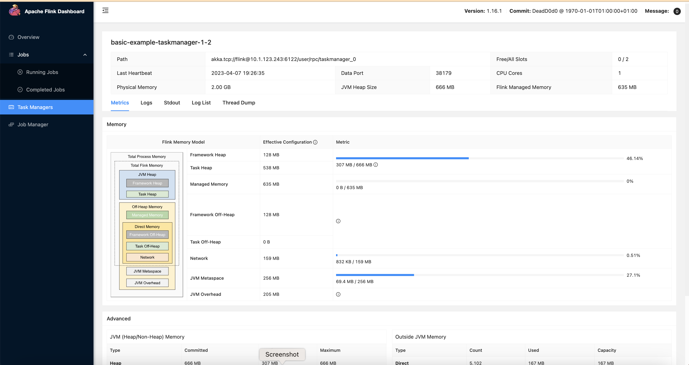
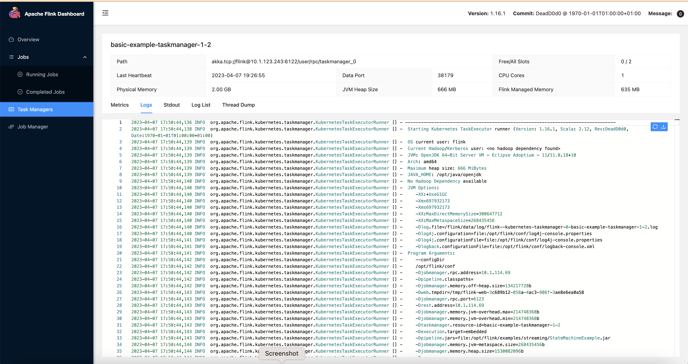
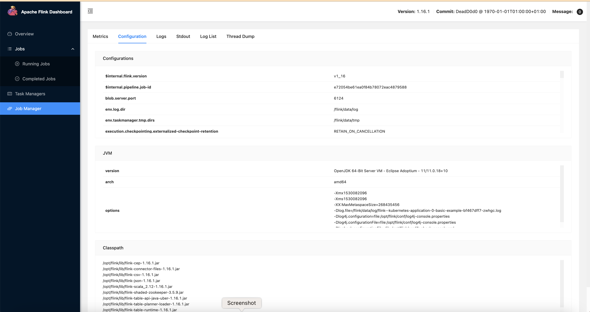

import Tabs from '@theme/Tabs';
import TabItem from '@theme/TabItem';
import CollapsibleContent from '../../../src/components/CollapsibleContent';

:::info
Please note that we are working on adding more features to this blueprint such as Flink examples with multiple connectors, Ingress for WebUI, Grafana dashboards etc.
:::

## Introduction to Apache Flink
[Apache Flink](https://flink.apache.org/) is an open-source, unified stream processing and batch processing framework that was designed to process large amounts of data. It provides fast, reliable, and scalable data processing with fault tolerance and exactly-once semantics.
Some of the key features of Flink are:
- **Distributed Processing**: Flink is designed to process large volumes of data in a distributed fashion, making it horizontally scalable and fault-tolerant.
- **Stream Processing and Batch Processing**: Flink provides APIs for both stream processing and batch processing. This means you can process data in real-time, as it's being generated, or process data in batches.
- **Fault Tolerance**: Flink has built-in mechanisms for handling node failures, network partitions, and other types of failures.
- **Exactly-once Semantics**: Flink supports exactly-once processing, which ensures that each record is processed exactly once, even in the presence of failures.
- **Low Latency**: Flink's streaming engine is optimized for low-latency processing, making it suitable for use cases that require real-time processing of data.
- **Extensibility**: Flink provides a rich set of APIs and libraries, making it easy to extend and customize to fit your specific use case.

## Architecture

Flink Architecture high level design with EKS.


## EMR on EKS Flink Kubernetes Operator
Amazon EMR releases 6.13.0 and higher support Amazon EMR on EKS with Apache Flink, or the , as a job submission model for Amazon EMR on EKS. With Amazon EMR on EKS with Apache Flink, you can deploy and manage Flink applications with the Amazon EMR release runtime on your own Amazon EKS clusters. Once you deploy the Flink Kubernetes operator in your Amazon EKS cluster, you can directly submit Flink applications with the operator. The operator manages the lifecycle of Flink applications.
1. Running, suspending and deleting applications
2. Stateful and stateless application upgrades
3. Triggering and managing savepoints
4. Handling errors, rolling-back broken upgrades

In addition to the above features, EMR Flink Kubernetes operator provides the following additional capabilities:
1. Launching Flink application using jars in Amazon S3
2. Monitoring integration with Amazon S3 and Amazon CloudWatch and container log rotation.
3. Automatically tunes Autoscaler configurations based on historical trends of observed metrics.
4. Faster Flink Job Restart during scaling or Failure Recovery
5. IRSA (IAM Roles for Service Accounts) Native Integration
6. Apache Airflow Integration
7. Pyflink support


Flink Operator defines two types of Custom Resources(CR) which are the extensions of the Kubernetes API.

<Tabs>
<TabItem value="FlinkDeployment" label="FlinkDeployment">


**FlinkDeployment**
- FlinkDeployment CR defines **Flink Application** and **Session Cluster** deployments.
- Application deployments manage a single job deployment on a dedicated Flink cluster in Application mode.
- Session clusters allows you to run multiple Flink Jobs on an existing Session cluster.

    <details>
    <summary>FlinkDeployment in Application modes, Click to toggle content!</summary>

    ```yaml
    apiVersion: flink.apache.org/v1beta1
    kind: FlinkDeployment
    metadata:
    namespace: default
    name: basic-example
    spec:
    image: flink:1.16
    flinkVersion: v1_16
    flinkConfiguration:
        taskmanager.numberOfTaskSlots: "2"
    serviceAccount: flink
    jobManager:
        resource:
        memory: "2048m"
        cpu: 1
    taskManager:
        resource:
        memory: "2048m"
        cpu: 1
    job:
        jarURI: local:///opt/flink/examples/streaming/StateMachineExample.jar
        parallelism: 2
        upgradeMode: stateless
        state: running
    ```
    </details>

</TabItem>

<TabItem value="FlinkSessionJob" label="FlinkSessionJob">

**FlinkSessionJob**
- The `FlinkSessionJob` CR defines the session job on the **Session cluster** and each Session cluster can run multiple `FlinkSessionJob`.
- Session deployments manage Flink Session clusters without providing any job management for it

    <details>
    <summary>FlinkSessionJob using an existing "basic-session-cluster" session cluster deployment</summary>

    ```yaml
    apiVersion: flink.apache.org/v1beta1
    kind: FlinkSessionJob
    metadata:
    name: basic-session-job-example
    spec:
    deploymentName: basic-session-cluster
    job:
        jarURI: https://repo1.maven.org/maven2/org/apache/flink/flink-examples-streaming_2.12/1.15.3/flink-examples-streaming_2.12-1.15.3-TopSpeedWindowing.jar
        parallelism: 4
        upgradeMode: stateless
    ```

    </details>

</TabItem>
</Tabs>

:::info
Session clusters use a similar spec to Application clusters with the only difference that `job` is not defined in the yaml spec.
:::

:::info
According to the Flink documentation, it is recommended to use FlinkDeployment in Application mode for production environments.
:::

On top of the deployment types the Flink Kubernetes Operator also supports two modes of deployments: `Native` and `Standalone`.

<Tabs>
<TabItem value="Native" label="Native">

**Native**

- Native cluster deployment is the default deployment mode and uses Flink’s built in integration with Kubernetes when deploying the cluster.
- Flink cluster communicates directly with Kubernetes and allows it to manage Kubernetes resources, e.g. dynamically allocate and de-allocate TaskManager pods.
- Flink Native can be useful for advanced users who want to build their own cluster management system or integrate with existing management systems.
- Flink Native allows for more flexibility in terms of job scheduling and execution.
- For standard Operator use, running your own Flink Jobs in Native mode is recommended.

```yaml
apiVersion: flink.apache.org/v1beta1
kind: FlinkDeployment
...
spec:
...
mode: native
```
</TabItem>

<TabItem value="Standalone" label="Standalone">

**Standalone**

- Standalone cluster deployment simply uses Kubernetes as an orchestration platform that the Flink cluster is running on.
- Flink is unaware that it is running on Kubernetes and therefore all Kubernetes resources need to be managed externally, by the Kubernetes Operator.

    ```yaml
    apiVersion: flink.apache.org/v1beta1
    kind: FlinkDeployment
    ...
    spec:
    ...
    mode: standalone
    ```

</TabItem>
</Tabs>

## Best Practices for Running Flink Jobs on Kubernetes
To get the most out of Flink on Kubernetes, here are some best practices to follow:

- **Use the Kubernetes Operator**: Install and use the Flink Kubernetes Operator to automate the deployment and management of Flink clusters on Kubernetes.
- **Deploy in dedicated namespaces**: Create a separate namespace for the Flink Kubernetes Operator and another one for Flink jobs/workloads. This ensures that the Flink jobs are isolated and have their own resources.
- **Use high-quality storage**: Store Flink checkpoints and savepoints in high-quality storage such as Amazon S3 or another durable external storage. These storage options are reliable, scalable, and offer durability for large volumes of data.
- **Optimize resource allocation**: Allocate sufficient resources to Flink jobs to ensure optimal performance. This can be done by setting resource requests and limits for Flink containers.
- **Proper network isolation**: Use Kubernetes Network Policies to isolate Flink jobs from other workloads running on the same Kubernetes cluster. This ensures that Flink jobs have the required network access without being impacted by other workloads.
- **Configure Flink optimally**: Tune Flink settings according to your use case. For example, adjust Flink's parallelism settings to ensure that Flink jobs are scaled appropriately based on the size of the input data.
- **Use checkpoints and savepoints**: Use checkpoints for periodic snapshots of Flink application state and savepoints for more advanced use cases such as upgrading or downgrading the application.
- **Store checkpoints and savepoints in the right places**: Store checkpoints in distributed file systems or key-value stores like Amazon S3 or another durable external storage. Store savepoints in a durable external storage like Amazon S3.

## Flink Upgrade
Flink Operator provides three upgrade modes for Flink jobs. Checkout the [Flink upgrade docs](https://nightlies.apache.org/flink/flink-kubernetes-operator-docs-main/docs/custom-resource/job-management/#stateful-and-stateless-application-upgrades) for up-to-date information.

1. **stateless**: Stateless application upgrades from empty state
2. **last-state**: Quick upgrades in any application state (even for failing jobs), does not require a healthy job as it always uses the latest checkpoint information. Manual recovery may be necessary if HA metadata is lost.
3. **savepoint**: Use savepoint for upgrade, providing maximal safety and possibility to serve as backup/fork point. The savepoint will be created during the upgrade process. Note that the Flink job needs to be running to allow the savepoint to get created. If the job is in an unhealthy state, the last checkpoint will be used (unless kubernetes.operator.job.upgrade.last-state-fallback.enabled is set to false). If the last checkpoint is not available, the job upgrade will fail.

:::info
`last-state` or `savepoint` are recommended modes for production
:::


<CollapsibleContent header={<h2><span>Deploying the Solution</span></h2>}>

In this [example](https://github.com/awslabs/data-on-eks/tree/main/streaming/flink), you will provision the following resources required to run Flink Jobs with Flink Operator and Apache YuniKorn.

This example deploys an EKS Cluster running the Flink Operator into a new VPC.

- Creates a new sample VPC, 2 Private Subnets and 2 Public Subnets
- Creates Internet gateway for Public Subnets and NAT Gateway for Private Subnets
- Creates EKS Cluster Control plane with public endpoint (for demo reasons only) with core managed node group, on-demand node group and Spot node group for Flink workloads
- Deploys Metrics server, Cluster Autoscaler, Apache YuniKorn, Karpenter, Grafana, AMP and Prometheus server
- Deploys Cert Manager and EMR Flink Operator. Flink Operator has dependency on Cert Manager
- Creates a new Flink Data team resources that includes namespace, IRSA, Role and Role binding
- Deploys three Karpenter provisioners for different compute types

### Prerequisites

Ensure that you have installed the following tools on your machine.

1. [aws cli](https://docs.aws.amazon.com/cli/latest/userguide/install-cliv2.html)
2. [kubectl](https://Kubernetes.io/docs/tasks/tools/)
3. [terraform](https://learn.hashicorp.com/tutorials/terraform/install-cli)

### Deploy

Clone the repository.

```bash
git clone https://github.com/awslabs/data-on-eks.git
```

Navigate into Flink's Terraform template directory and run `install.sh` script.

```bash
cd data-on-eks/streaming/emr-flink-eks
chmod +x install.sh
./install.sh
```
Verify the cluster status

```bash
    ➜ kubectl get nodes -A
    NAME                                         STATUS   ROLES    AGE   VERSION
    ip-10-1-160-150.us-west-2.compute.internal   Ready    <none>   24h   v1.24.11-eks-a59e1f0
    ip-10-1-169-249.us-west-2.compute.internal   Ready    <none>   6d    v1.24.11-eks-a59e1f0
    ip-10-1-69-244.us-west-2.compute.internal    Ready    <none>   6d    v1.24.11-eks-a59e1f0

    ➜  ~ kubectl get pods -n flink-kubernetes-operator-ns
    NAME                                         READY   STATUS    RESTARTS   AGE
    flink-kubernetes-operator-555776785f-pzx8p   2/2     Running   0          4h21m
    flink-kubernetes-operator-555776785f-z5jpt   2/2     Running   0          4h18m

    ➜  ~ kubectl get pods -n cert-manager
    NAME                                      READY   STATUS    RESTARTS   AGE
    cert-manager-77fc7548dc-dzdms             1/1     Running   0          24h
    cert-manager-cainjector-8869b7ff7-4w754   1/1     Running   0          24h
    cert-manager-webhook-586ddf8589-g6s87     1/1     Running   0          24h
```

To list all the resources created for Flink team to run Flink jobs using this namespace

```bash
    ➜  ~ kubectl get all,role,rolebinding,serviceaccount --namespace flink-team-a-ns
    NAME                                               CREATED AT
    role.rbac.authorization.k8s.io/flink-team-a-role   2023-04-06T13:17:05Z

    NAME                                                              ROLE                     AGE
    rolebinding.rbac.authorization.k8s.io/flink-team-a-role-binding   Role/flink-team-a-role   22h

    NAME                             SECRETS   AGE
    serviceaccount/default           0         22h
    serviceaccount/flink-team-a-sa   0         22h
```

</CollapsibleContent>


<CollapsibleContent header={<h2><span>Execute Sample Flink job with Karpenter</span></h2>}>

Navigate to example directory and submit the Flink job.

```bash
cd data-on-eks/streaming/emr-eks-flink/examples
```
Get the role arn linked to the job execution service account.
```bash
terraform output flink_jobs_role_arn

"arn:aws:iam::681921237057:role/emr-eks-flink-flink-team-a-20240402170622025900000001"
```

Open the basic-example-app-cluster.yaml in any editor and replace the place holder for **REPLACE_WITH_JOB_EXECUTION_ROLE_ARN** with the role ARN that you got from the terraform output command and save the file.

Deploy the job by running the kubectl deply command.

```bash
kubectl apply -f basic-example-app-cluster.yaml
```

Monitor the job status using the below command.
You should see the new nodes triggered by the karpenter and the YuniKorn will schedule one Job manager pod and one Taskmanager pods on this node.

```bash
kubectl get deployments -n flink-team-a-ns
NAME                              READY   UP-TO-DATE   AVAILABLE   AGE
basic-example-app-cluster-flink   2/2     2            2           3h6m

kubectl get pods -n flink-team-a-ns
NAME                                               READY   STATUS    RESTARTS   AGE
basic-example-app-cluster-flink-7c7d9c6fd9-cdfmd   2/2     Running   0          3h7m
basic-example-app-cluster-flink-7c7d9c6fd9-pjxj2   2/2     Running   0          3h7m
basic-example-app-cluster-flink-taskmanager-1-1    2/2     Running   0          3h6m

kubectl get services -n flink-team-a-ns
NAME                                   TYPE        CLUSTER-IP      EXTERNAL-IP   PORT(S)    AGE
basic-example-app-cluster-flink-rest   ClusterIP   172.20.17.152   <none>        8081/TCP   3h7m
```

To access the Flink WebUI for the job run this command locally.

```bash
kubectl port-forward svc/basic-example-app-cluster-flink-rest 8081 -n flink-team-a-ns
```







</CollapsibleContent>


<CollapsibleContent header={<h2><span>Cleanup</span></h2>}>

This script will cleanup the environment using `-target` option to ensure all the resources are deleted in correct order.

```bash
cd .. && chmod +x cleanup.sh
./cleanup.sh
```

</CollapsibleContent>

:::caution
To avoid unwanted charges to your AWS account, delete all the AWS resources created during this deployment
:::
