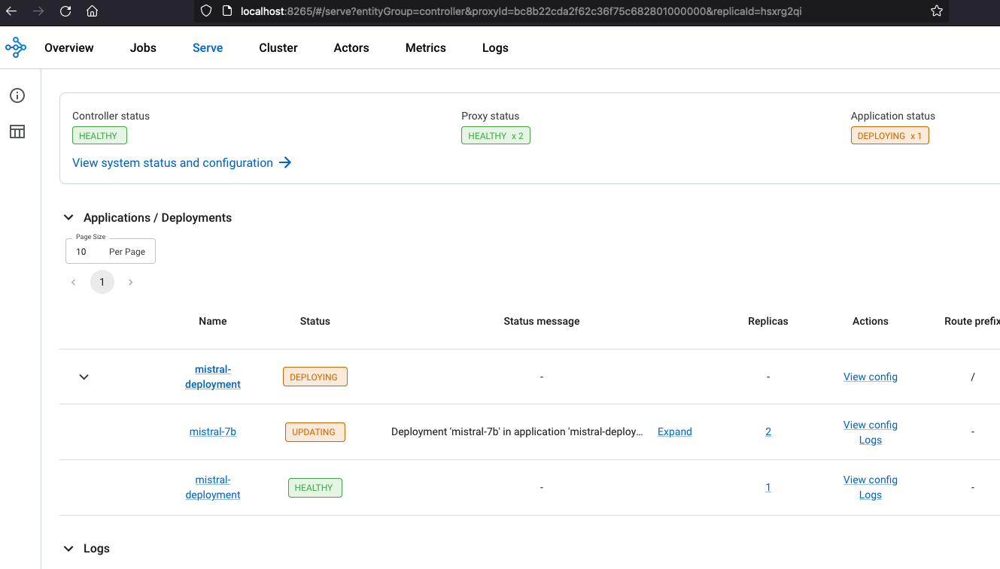
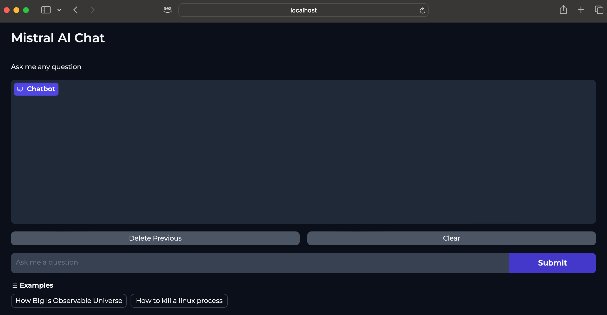
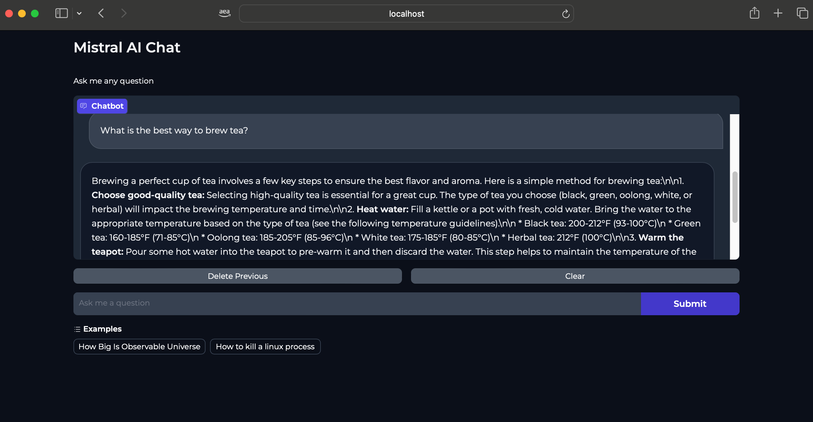

import CollapsibleContent from '../../../src/components/CollapsibleContent';

:::danger

Note: Mistral-7B-Instruct-v0.2 is a gated model in [Huggingface](https://huggingface.co/mistralai/Mistral-7B-Instruct-v0.2) repository. In order to use this model, one needs to use a HuggingFace Token.
To generate a token in HuggingFace, log in using your HuggingFace account and click on `Access Tokens` menu item on the [Settings](https://huggingface.co/settings/tokens) page.

:::

# Deploying Mistral-7B-Instruct-v0.2 with AWS Inferentia2, Ray Serve and Gradio
This pattern demonstrates how to deploy the [Mistral-7B-Instruct-v0.2](https://huggingface.co/mistralai/Mistral-7B-Instruct-v0.2) model on Amazon EKS, using [AWS Inferentia2](https://aws.amazon.com/ec2/instance-types/inf2/) for accelerated image generation. [Ray Serve](https://docs.ray.io/en/latest/serve/index.html) provides efficient scaling of Ray Worker nodes, while [Karpenter](https://karpenter.sh/) dynamically manages AWS Inferentia2 node provisioning.

Through this pattern, you will accomplish the following:

- Create an Amazon EKS cluster with a Karpenter managed AWS Inferentia2 nodepool for dynamic provisioning of Nodes.
- Install KubeRay Operator and other core EKS add-ons using the [trainium-inferentia](https://github.com/awslabs/data-on-eks/tree/main/ai-ml/trainium-inferentia) Terraform blueprint.
- Deploy the Mistral-7B-Instruct-v0.2 model using RayServe for efficient scaling.

### What is Mistral-7B-Instruct-v0.2 Model?

The `mistralai/Mistral-7B-Instruct-v0.2` is an instruction-tuned version of the `Mistral-7B-v0.2 base model`, which has been fine-tuned using publicly available conversation datasets. It is designed to follow instructions and complete tasks, making it suitable for applications such as chatbots, virtual assistants, and task-oriented dialogue systems. It is built on top of the `Mistral-7B-v0.2` base model, which has 7.3 billion parameters and employs a state-of-the-art architecture including Grouped-Query Attention (GQA) for faster inference and a Byte-fallback BPE tokenizer for improved robustness.

Please refer to the [Model Card](https://replicate.com/mistralai/mistral-7b-instruct-v0.2/readme) for more detail.

## Deploying the Solution
Let's get Mistral-7B-Instruct-v0.2 model up and running on Amazon EKS! In this section, we'll cover:

- **Prerequisites**: Ensuring you have everything in place.
- **Infrastructure Setup**: Creating your EKS cluster and preparing it for deployment.
- **Deploying the Ray Cluster**: The core of your image generation pipeline, providing scalability and efficiency.
- **Building the Gradio Web UI**: A user-friendly interface for interacting with Mistral 7B.

<CollapsibleContent header={<h2><span>Prerequisites</span></h2>}>
Before we begin, ensure you have all the prerequisites in place to make the deployment process smooth and hassle-free.
Ensure that you have installed the following tools on your machine.

1. [aws cli](https://docs.aws.amazon.com/cli/latest/userguide/install-cliv2.html)
2. [kubectl](https://Kubernetes.io/docs/tasks/tools/)
3. [terraform](https://learn.hashicorp.com/tutorials/terraform/install-cli)
4. [envsubst](https://pypi.org/project/envsubst/)

### Deploy

Clone the repository

```bash
git clone https://github.com/awslabs/data-on-eks.git
```

Navigate into one of the example directories and run `install.sh` script

**Important Note:** Ensure that you update the region in the `variables.tf` file before deploying the blueprint.
Additionally, confirm that your local region setting matches the specified region to prevent any discrepancies.
For example, set your `export AWS_DEFAULT_REGION="<REGION>"` to the desired region:

```bash
cd data-on-eks/ai-ml/trainium-inferentia/ && chmod +x install.sh
./install.sh
```

### Verify the resources

Verify the Amazon EKS Cluster

```bash
aws eks --region us-west-2 describe-cluster --name trainium-inferentia
```

```bash
# Creates k8s config file to authenticate with EKS
aws eks --region us-west-2 update-kubeconfig --name trainium-inferentia

# Output shows the EKS Managed Node group nodes
kubectl get nodes
```

</CollapsibleContent>

## Deploying the Ray Cluster with Mistral 7B Model

Once the `trainium-inferentia` cluster is deployed, you can proceed to use `kubectl` to deploy the `ray-service-mistral.yaml` from `/data-on-eks/gen-ai/inference/mistral-7b-rayserve-inf2/` path.

In this step, we will deploy the Ray Serve cluster, which comprises one `Head Pod` on `x86 CPU` instances using Karpenter autoscaling, as well as `Ray workers` on `inf2.24xlarge` instances, autoscaled by [Karpenter](https://karpenter.sh/).

Let's take a closer look at the key files used in this deployment and understand their functionalities before proceeding with the deployment:
- **ray_serve_mistral.py:**
  This script sets up a FastAPI application with two main components deployed using Ray Serve, which enables scalable model serving on AWS Neuron infrastructure(Inf2):
  - **mistral-7b Deployment**: This class initializes the Mistral 7B model using a scheduler and moves it to an Inf2 node for processing. The script leverages Transformers Neuron support for grouped-query attention (GQA) models for this Mistral model. The `mistral-7b-instruct-v0.2` is a chat based model. The script also adds the required prefix for instructions by adding `[INST]` and `[/INST]` tokens surrounding the actual prompt.
  - **APIIngress**: This FastAPI endpoint acts as an interface to the Mistral 7B model. It exposes a GET method on the `/infer` path that takes a text prompt. It responds to the prompt by replying with a text.

- **ray-service-mistral.yaml:**
  This RayServe deployment pattern sets up a scalable service for hosting the Mistral-7B-Instruct-v0.2 Model model on Amazon EKS with AWS Inferentia2 support. It creates a dedicated namespace and configures a RayService with autoscaling capabilities to efficiently manage resource utilization based on incoming traffic. The deployment ensures that the model, served under the RayService umbrella, can automatically adjust replicas, depending on demand, with each replica requiring 2 neuron cores. This pattern makes use of custom container images designed to maximize performance and minimizes startup delays by ensuring that heavy dependencies are preloaded.

### Deploy the Mistral-7B-Instruct-v0.2 Model

Ensure the cluster is configured locally

```bash
aws eks --region us-west-2 update-kubeconfig --name trainium-inferentia
```

**Deploy RayServe Cluster**

```bash
# set the Hugging Face Hub Token as an environment variable. This variable will be substituted when applying the ray-service-mistral.yaml file
export  HUGGING_FACE_HUB_TOKEN=<Your-Hugging-Face-Hub-Token-Value>
cd data-on-eks/gen-ai/
envsubst < inference/mistral-7b-rayserve-inf2/ray-service-mistral.yaml| kubectl apply -f -
```

Verify the deployment by running the following commands

:::info

The deployment process may take up to 10 to 12 minutes. The Head Pod is expected to be ready within 2 to 3 minutes, while the Ray Serve worker pod may take up to 10 minutes for image retrieval and Model deployment from Huggingface.

:::

This deployment establishes a Ray head pod running on an x86 instance and a worker pod on inf2.24xl instance as shown below.

```bash
kubectl get pods -n mistral

NAME                                                      READY   STATUS
service-raycluster-68tvp-worker-inf2-worker-group-2kckv   1/1     Running
mistral-service-raycluster-68tvp-head-dmfz5               2/2     Running
```

This deployment also sets up a mistral service with multiple ports configured; port `8265` is designated for the Ray dashboard and port `8000` for the Mistral model endpoint.

```bash
kubectl get svc -n mistral

NAME                        TYPE       CLUSTER-IP       EXTERNAL-IP   PORT(S)  
mistral-service             NodePort   172.20.118.238   <none>        10001:30998/TCP,8000:32437/TCP,52365:31487/TCP,8080:30351/TCP,6379:30392/TCP,8265:30904/TCP  
mistral-service-head-svc    NodePort   172.20.245.131   <none>        6379:31478/TCP,8265:31393/TCP,10001:32627/TCP,8000:31251/TCP,52365:31492/TCP,8080:31471/TCP  
mistral-service-serve-svc   NodePort   172.20.109.223   <none>        8000:31679/TCP
```

For the Ray dashboard, you can port-forward these ports individually to access the web UI locally using localhost.

```bash
kubectl -n mistral port-forward svc/mistral-service 8265:8265
```

Access the web UI via `http://localhost:8265` . This interface displays the deployment of jobs and actors within the Ray ecosystem.



Once the deployment is complete, the Controller and Proxy status should be `HEALTHY` and Application status should be `RUNNING`


You can monitor Serve deployment and the Ray Cluster deployment including resource utilization using the Ray Dashboard.


## Deploying the Gradio WebUI App
Discover how to create a user-friendly chat interface using [Gradio](https://www.gradio.app/) that integrates seamlessly with deployed models.

Let's move forward with setting up the Gradio app as a Kubernetes deployment, utilizing a Docker container. This setup will enable interaction with the Mistral model, which is deployed using RayServe.

:::info

The Gradio UI application is containerized and the container image is stored in [data-on-eks](https://gallery.ecr.aws/data-on-eks/gradio-app) public repository. The Gradio app container internally points to the `mistral-service` that's running on port 8000.

:::

### Deploy the Gradio Pod as Deployment

As part of the deployment, there's a publicly available Docker image for the mistral-7b Gradio UI app at [Data-on-EKS](public.ecr.aws/data-on-eks/gradio-app:mistral-7b) repository that can be used as is.
The Dockerfile for the above image is available at `data-on-eks/gen-ai/inference/gradio-ui/Dockerfile-app-mistral` path.

You can also customize the Gradio UI app according to your design requirements.
To build a custom Gradio app Docker image, please run the below commands. Please make sure to change the image `tag` and custom `Dockerfile` name accordingly.

```bash
cd data-on-eks/gen-ai/inference
docker buildx build --platform=linux/amd64 -t gradio-app:<tag> -f gradio-ui/<Custom-Dockerfile> gradio-ui/
```

Then, deploy the Gradio app as a Deployment on EKS using kubectl:

```bash
cd data-on-eks/gen-ai/inference/
kubectl apply -f mistral-7b-rayserve-inf2/gradio-deploy.yaml

namespace/gradio created
deployment.apps/gradio-deployment created
service/gradio-service created
```

This should create a Deployment and a Service in namespace `gradio`. Check the status of the resources.

```bash
NAME                                     READY   STATUS    RESTARTS   AGE
pod/gradio-deployment-846cb4dbf6-plmgc   1/1     Running   0          61s

NAME                     TYPE        CLUSTER-IP       EXTERNAL-IP   PORT(S)    AGE
service/gradio-service   ClusterIP   172.20.179.184   <none>        7860/TCP   60s

NAME                                READY   UP-TO-DATE   AVAILABLE   AGE
deployment.apps/gradio-deployment   1/1     1            1           62s

NAME                                           DESIRED   CURRENT   READY   AGE
replicaset.apps/gradio-deployment-846cb4dbf6   1         1         1       62s
```

#### Invoke the WebUI

Execute a port forward to the `gradio-service` Service using kubectl:

```bash
kubectl -n gradio port-forward service/gradio-service 8080:7860
```

Open your web browser and access the Gradio WebUI by navigating to the following URL:

Running on local URL:  http://localhost:8080

You should now be able to interact with the Gradio application from your local machine.



#### Interaction With Mistral Model

Mistral-7B-Instruct-v0.2 Model can be used for purposes such as chat applications (Q&A, conversation), text generation, knowledge retrieval and others.

Below screenshots provide some examples of the model response based on different text prompts.




## Cleanup
Finally, we'll provide instructions for cleaning up and deprovisioning the resources when they are no longer needed.

**Step1:** Delete Ray Cluster

```bash
cd data-on-eks/gen-ai/inference/mistral-7b-rayserve-inf2
kubectl delete -f ray-service-mistral.yaml
```

**Step2:** Cleanup the EKS Cluster
This script will cleanup the environment using `-target` option to ensure all the resources are deleted in correct order.

```bash
export AWS_DEAFULT_REGION="DEPLOYED_EKS_CLUSTER_REGION>"
cd data-on-eks/ai-ml/trainium-inferentia/ && chmod +x cleanup.sh
./cleanup.sh
```
